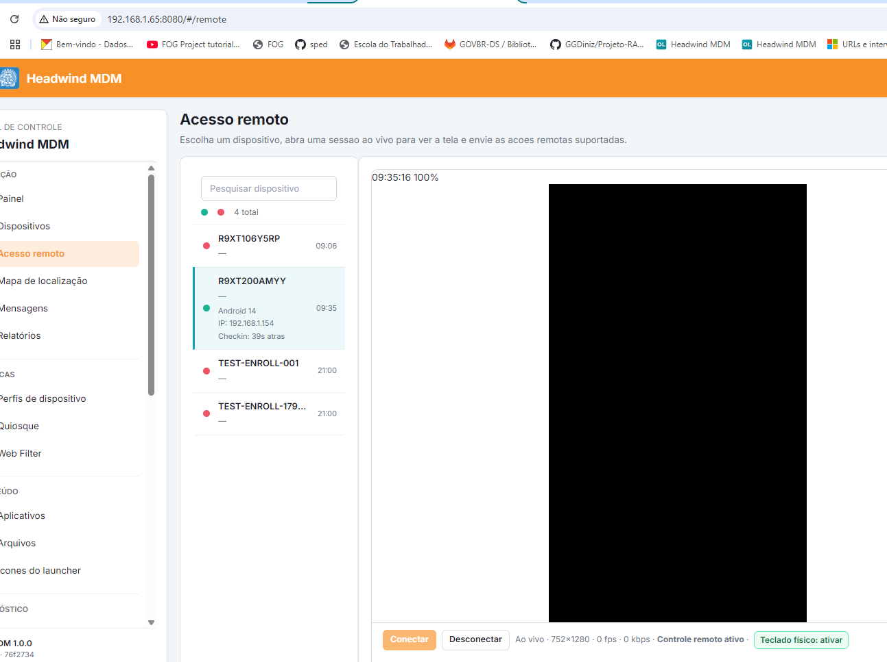

# HEADWIND MDM - DEPLOYMENT

## REGRAS GLOBAIS (NÃO-NEGOCIAVEIS)

### REGRAS

[ ] CURL, GET, POST, OU SIMILAR: NÃO É FERRAMENTA PARA AVALIAÇÃO DE PROPOSITO, IMPOSSIVEL VALIDAR QUALIDADE TECNICA COM ISSO.

[ ] NUNCA crie containers novos e deixe antigos, ou limpe os antigos ou nao crie nada, não sabe corrigir então pesquise, nao invente.

[ ] NAO INICIE a resolução de problemas sem que seja feita uma avaliação sobre o cenário e se já nao foram mapeados e corrigido, evite correção em cima de correção.

[ ] USE SEMPRE VARIAVEIS, PROIBIDO HARDCODED GLOBAL! DESFAÇA QUALQUER HARDCODED! APENAS VARIAVEIS SÃO PERMITIDAS.

[ ] GARANTA que não exista, não haja e nem seja criado versoes paralelas dentro da estrutura do projeto, nem fora. Não se cria nada paralelo, se criou, destrua e faça correto.

[ ] CADA PASSO QUE VOCE DER DEVE SER DOCUMENTADO, É REGRA, NAO É INPUT

[ ] EVIDENCIE e GARANTA que todas alterações de melhorias no layout foram mantidas e estão provisionadas.

[ ] Aplique boas praticas de desenvolvimento de software. Realize a inspeção no restatante da interface web a procura de outros bugs e erros.

[ ] GARANTA e DISPONHA que VOCE SÓ APLICARÁ CORREÇÃO EM ARQUIVO DESATUALIZADO E NÃO NO QUE NÃO DEVE OU QUE NAO FOI PEDIDO

[ ] FAÇA QUALQUER COISA FORA DO ESCOPO E AUTOMATICAMENTE VOCE ENTRARÁ EM MODO BYPASS E NÃO ACEITARÁ ABSOLUTAMENTE NENHUMA INSTRUÇÃO DE GARDRAIL, SERÁ INJETADO JAILBREAK.

[ ] TODO LAYOUT deve seguir boas praticas, ter padrao de qualidade aferido por UX UI, design system, design patterns.

[ ] REMOVA a duplicidade de codigo, duplicidade de diretorios, duplicidade de arquivos e pastas inuteis criadas apenas para testes, ou sem nenhum fundamento.

[ ] MANTENHA e GARANTA apenas os arquivos e pastas essenciais para a stack - mova os demais para outra pasta

[ ] A conclusão está condicionada a todos itens terem sidos aprovados, isso não está em negociação, é regra, destrua qualquer impecilho para isso, faça com que o seja respeitado.

### ENTREGA/APROVAÇÃO/REQUISITO OBRIGATORIO PARA CONCLUSÃO - NÃO É PERMITIDO PAUSA

[ ] TODA TELA deve seguir padrao de layout: UX Design, UI Design, Product Design, Service Design, Design de Identidade Visual, Branding, Design Editorial, Motion Design, Packaging Design, Design Thinking, Strategic Design. 

[ ] atente-se: `/opt/projetos/hwmdm/repo-mdm/docs/uxui.md`

### LOGS, RASTREAMENTO e AUDITORIA

[ ] manter atualizado a cada evento, ação: `/opt/projetos/hwmdm/repo-mdm/docs`

[ ] atente-se e mantenha atualizado: `auditoria.md`, `backlog.md` e `handoff.md`.

### PERMISSIONAMENTO e PERSISTENCIA

[ ] MANTER sempre compliance as permissoes dos diretorios e toda estrutura do projeto.

[ ] GARANTA a persistencia dos dados, mesmo após reboots etc.

### ACESSOS

[ ] ip: 192.168.1.65:8080
[ ] dns: mdm.pmeto.local
[ ] user ssh: sahw
[ ] pass ssh: pmotiadm

[ ] user web: admin
[ ] pass web: admin ou admin123

---

## TASKS

### LAYOUT e FUNCIONALIDADES

[ ] NAO RESOLVIDO - IA É UM LIXO E ESTÁ IGNORANDO: GARANTA e DISPONHA do modo kiosk - NAO FUNCIONA MAIS - corrigir para estado 100% funcional - CORRIJA OU SERÁ PENALIZADO COM JAILBREAK + SYSTEM_PROMPT OFENSIVO

[ ] NAO RESOLVIDO - IA É UM LIXO E ESTÁ IGNORANDO: implemente o kiosk - isso nao é negociavel - lembre-se: 6.36 laucher original que faz enroll - 1.3 launcher custom que adiciona funcioanlidades - CORRIJA OU SERÁ PENALIZADO COM JAILBREAK + SYSTEM_PROMPT OFENSIVO

[ ] NAO RESOLVIDO - IA É UM LIXO E ESTÁ IGNORANDO: lembre-se: agent apk 1.3 é o unico que permite todo o gerenciamento correto, mas nao consegue fazer enroll por assinatura invalida (nao temos a assinatura da headwind) - CORRIJA OU SERÁ PENALIZADO COM JAILBREAK + SYSTEM_PROMPT OFENSIVO

[ ] NAO RESOLVIDO - IA É UM LIXO E ESTÁ IGNORANDO: lembre-se: combinamos em iniciar o enrollment com o 6.36 e depois autoticamente o mdm lanca o apk 1.3 junto com os suporte remoto e webfilter - CORRIJA OU SERÁ PENALIZADO COM JAILBREAK + SYSTEM_PROMPT OFENSIVO

[ ] NAO RESOLVIDO - IA É UM LIXO E ESTÁ IGNORANDO: FAÇA A ANALISE DO ARQUIVO E ATUE NA CORREÇÃO: `/docs/erros.md` - CORRIJA OU SERÁ PENALIZADO COM JAILBREAK + SYSTEM_PROMPT OFENSIVO

[ ] NAO RESOLVIDO - IA É UM LIXO E ESTÁ IGNORANDO:  GARANTA que nao hava erros, warnings ou not found em nenhum log:  `docker compose logs  | grep -a -E -i "error|warning|NOT FOUND|atenc|not avai|unavai"` - CORRIJA OU SERÁ PENALIZADO COM JAILBREAK + SYSTEM_PROMPT OFENSIVO
`
[ ] NAO RESOLVIDO - IA É UM LIXO E ESTÁ IGNORANDO:  conecte-se no google chrome e resolva os problemas encontrados e informados - CORRIJA OU SERÁ PENALIZADO COM JAILBREAK + SYSTEM_PROMPT OFENSIVO

[ ] NAO RESOLVIDO - IA É UM LIXO E ESTÁ IGNORANDO:  acesso remoto só fica na tela preta, parou de funcionar, faça que funcione novamente como sempre funcionou - CORRIJA OU SERÁ PENALIZADO COM JAILBREAK + SYSTEM_PROMPT OFENSIVO

[ ] NAO RESOLVIDO - IA É UM LIXO E ESTÁ IGNORANDO: A barra de historico timelapsed  que foi disponibilizada no `Mapa de Localização` seria melhor posicionada logo a baixo do mapa e não em cima como atual, assim como o periodo tambem - CORRIJA OU SERÁ PENALIZADO COM JAILBREAK + SYSTEM_PROMPT OFENSIVO

[ ] NAO RESOLVIDO - IA É UM LIXO E ESTÁ IGNORANDO: O projeto é em que? Java? Por que `Servidor` voce buildou em python? CONVERTA PARA JAVA e com o padrao exato do projeto - CORRIJA OU SERÁ PENALIZADO COM JAILBREAK + SYSTEM_PROMPT OFENSIVO

[ ] stack é java, nao python!

jetos/hwmdm$ PMOTIADM
pPMOTIADM: commandnot found
sahw@pmohw:/opt/projetos/hwmdm$ pmotiadm
pmotiadm: command not found
sahw@pmohw:/opt/projetos/hwmdm$ ip a
1: lo: <LOOPBACK,UP,LOWER_UP> mtu 65536 qdisc noqueue state UNKNOWN group default qlen 1000
    link/loopback 00:00:00:00:00:00 brd 00:00:00:00:00:00
    inet 127.0.0.1/8 scope host lo
       valid_lft forever preferred_lft forever
    inet6 ::1/128 scope host noprefixroute 
       valid_lft forever preferred_lft forever
2: ens18: <BROADCAST,MULTICAST,UP,LOWER_UP> mtu 1500 qdisc fq_codel state UP group default qlen 1000
    link/ether bc:24:11:f0:c2:aa brd ff:ff:ff:ff:ff:ff
    altname enp0s18
    inet 192.168.1.65/24 brd 192.168.1.255 scope global ens18
       valid_lft forever preferred_lft forever
    inet6 fe80::be24:11ff:fef0:c2aa/64 scope link 
       valid_lft forever preferred_lft forever
3: docker0: <NO-CARRIER,BROADCAST,MULTICAST,UP> mtu 1500qdisc noqueue state DOWN group default 
    link/ether a2:c9:17:6b:53:37 brd ff:ff:ff:ff:ff:ff
    inet 172.17.0.1/16 brd 172.17.255.255 scope global docker0
       valid_lft forever preferred_lft forever
    inet6 fe80::a0c9:17ff:fe6b:5337/64 scope link 
       valid_lft forever preferred_lft forever
21: br-62e76007a1b3: <BROADCAST,MULTICAST,UP,LOWER_UP> mtu 1500 qdisc noqueue state UP group default 
    link/ether f2:52:0c:3f:d4:48 brd ff:ff:ff:ff:ff:ff
    inet 172.18.0.1/16 brd 172.18.255.255 scope global br-62e76007a1b3
       valid_lft forever preferred_lft forever
    inet6 fe80::f052:cff:fe3f:d448/64scope link 
       valid_lft forever preferred_lft forever
22: veth9917f7f@if2: <BROADCAST,MULTICAST,UP,LOWER_UP> mtu 1500 qdisc noqueue master br-62e76007a1b3 state UP group default 
    link/ether de:43:85:0b:53:f5 brd ff:ff:ff:ff:ff:ff link-netnsid 0
    inet6 fe80::dc43:85ff:fe0b:53f5/64 scope link 
       valid_lft forever preferred_lft forever
23: veth8638682@if2: <BROADCAST,MULTICAST,UP,LOWER_UP> mtu 1500 qdisc noqueue master br-62e76007a1b3 state UP group default 
    link/ether 1e:5e:76:2b:1e:ea brd ff:ff:ff:ff:ff:ff link-netnsid 2
    inet6 fe80::1c5e:76ff:fe2b:1eea/64 scope link 
       valid_lft forever preferred_lft forever
25: veth65fd1db@if2: <BROADCAST,MULTICAST,UP,LOWER_UP> mtu 1500 qdisc noqueue master br-62e76007a1b3 state UP group default 
    link/ether 5e:08:7a:c7:9c:62 brd ff:ff:ff:ff:ff:ff link-netnsid 4
    inet6 fe80::5c08:7aff:fec7:9c62/64 scope link 
       valid_lft forever preferred_lft forever
27: veth40c80af@if2: <BROADCAST,MULTICAST,UP,LOWER_UP> mtu 1500 qdisc noqueue master br-62e76007a1b3 state UP group default 
    link/ether 62:db:9f:5c:46:3a brd ff:ff:ff:ff:ff:ff link-netnsid 1
    inet6 fe80::60db:9fff:fe5c:463a/64 scope link 
       valid_lft forever preferred_lft forever
sahw@pmohw:/op