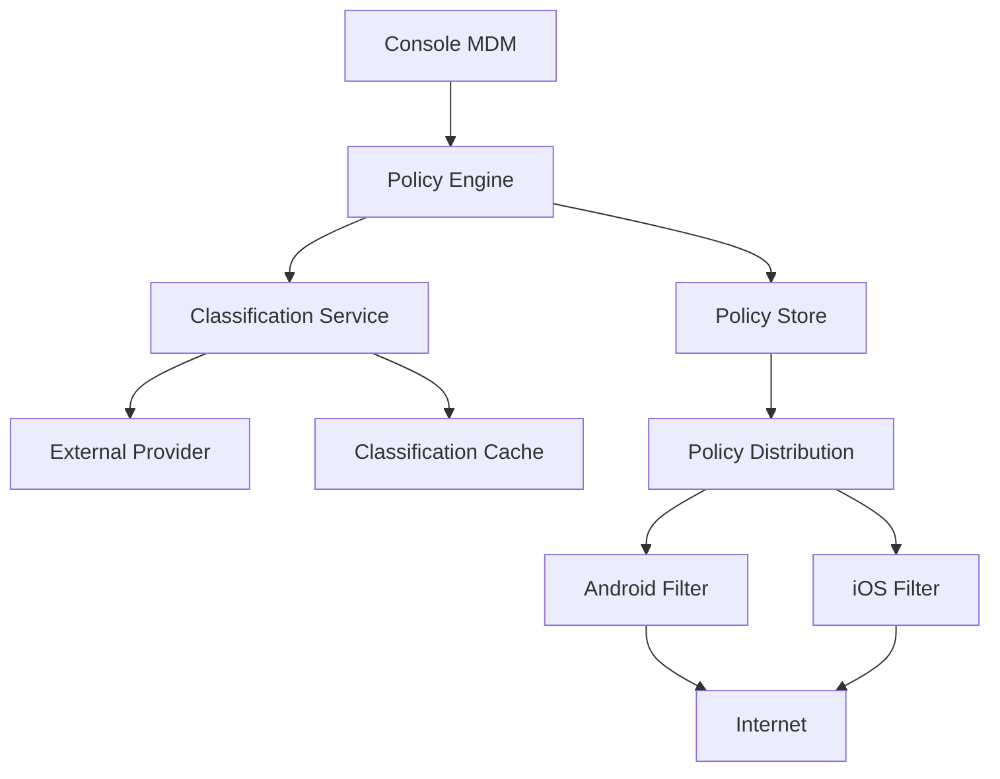
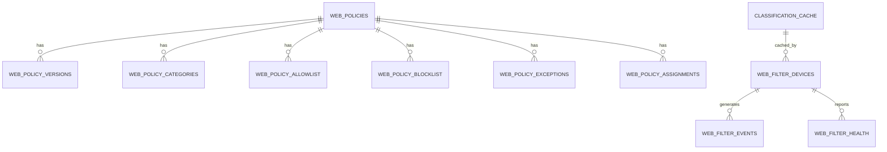
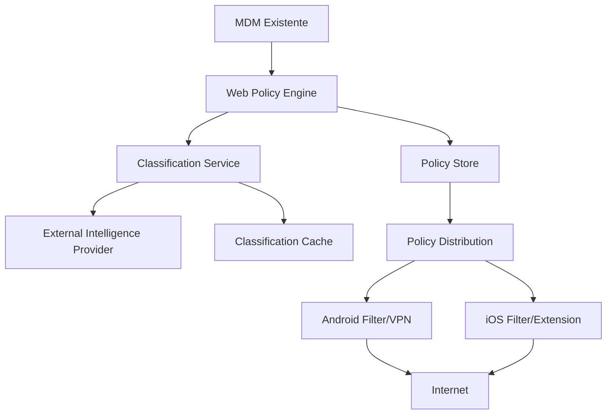
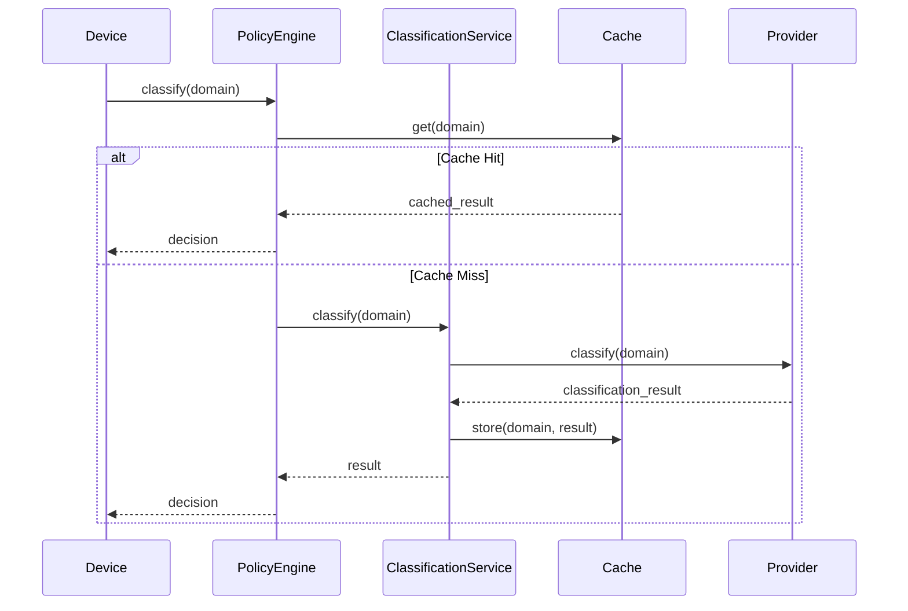

# PRD — Módulo Enterprise de Filtragem Web para MDM Mobile

**Produto:** MDM — Mobile Device Management
**Módulo:** Enterprise Web Filtering
**Plataformas:** Android Enterprise e iOS/iPadOS
**Tipo:** Extensão de MDM existente
**Status:** Proposta de produto / arquitetura
**Versão:** 1.1 (corrigida e classificada por níveis de implementação)
**Data:** 2026-09-10
**Autor:** Equipe de Produto MDM

---

## Índice

1. [Visão Geral](#1-visão-geral)
2. [Objetivos](#2-objetivos)
3. [Problema](#3-problema)
4. [Escopo](#4-escopo)
5. [Fora do Escopo do MVP](#5-fora-do-escopo-do-mvp)
6. [Princípio Arquitetural](#6-princípio-arquitetural)
7. [Conceito Fundamental](#7-conceito-fundamental)
8. [Componentes do Sistema](#8-componentes-do-sistema)
9. [Modelo de Política](#9-modelo-de-política)
10. [Categorias](#10-categorias)
11. [Requisito de Categorização Automática](#11-requisito-de-categorização-automática)
12. [Classification Cache](#12-classification-cache)
13. [TTL (Time To Live)](#13-ttl-time-to-live)
14. [Confiança da Classificação](#14-confiança-da-classificação)
15. [Domínios Desconhecidos](#15-domínios-desconhecidos)
16. [Categorias de Segurança](#16-categorias-de-segurança)
17. [Hierarquia de Decisão](#17-hierarquia-de-decisão)
18. [Exceções](#18-exceções)
19. [Tipos de Exceção](#19-tipos-de-exceção)
20. [Allowlist](#20-allowlist)
21. [Blocklist](#21-blocklist)
22. [Política por Grupo](#22-política-por-grupo)
23. [Política por Dispositivo](#23-política-por-dispositivo)
24. [Policy Inheritance](#24-policy-inheritance)
25. [Policy Versioning](#25-policy-versioning)
26. [Assinatura da Política](#26-assinatura-da-política)
27. [Rollback](#27-rollback)
28. [Offline Enforcement](#28-offline-enforcement)
29. [Android Enterprise](#29-android-enterprise)
30. [Android — Arquitetura](#30-android--arquitetura)
31. [iOS/iPadOS](#31-iosipados)
32. [iOS — Arquitetura](#32-ios--arquitetura)
33. [Não Construir um Segundo MDM Agent](#33-não-construir-um-segundo-mdm-agent)
34. [Policy Distribution](#34-policy-distribution)
35. [Estado da Distribuição](#35-estado-da-distribuição)
36. [Heartbeat](#36-heartbeat)
37. [Auditoria](#37-auditoria)
38. [Privacidade](#38-privacidade)
39. [Evento de Bloqueio](#39-evento-de-bloqueio)
40. [Eventos de Segurança](#40-eventos-de-segurança)
41. [Event Queue](#41-event-queue)
42. [Proteção contra Alteração](#42-proteção-contra-alteração)
43. [HTTPS](#43-https)
44. [Limitação Importante](#44-limitação-importante)
45. [Proteção contra Bypass](#45-proteção-contra-bypass)
46. [Classification Provider Adapter](#46-classification-provider-adapter)
47. [Provider Abstraction](#47-provider-abstraction)
48. [Provider Failure](#48-provider-failure)
49. [Circuit Breaker](#49-circuit-breaker)
50. [Batch Classification](#50-batch-classification)
51. [Preclassification](#51-preclassification)
52. [Policy Simulator](#52-policy-simulator)
53. [Console — Telas](#53-console--telas)
54. [Allowlist / Blocklist](#54-allowlist--blocklist)
55. [Exceptions](#55-exceptions)
56. [Schedules](#56-schedules)
57. [Relatórios](#57-relatórios)
58. [Métricas](#58-métricas)
59. [Segurança](#59-segurança)
60. [RBAC](#60-rbac)
61. [Auditoria Administrativa](#61-auditoria-administrativa)
62. [Multi-tenancy](#62-multi-tenancy)
63. [Modelo de Dados](#63-modelo-de-dados)
64. [Relacionamentos](#64-relacionamentos)
65. [API](#65-api)
66. [Policy Evaluation API](#66-policy-evaluation-api)
67. [Fluxo de Publicação](#67-fluxo-de-publicação)
68. [Atomic Policy Update](#68-atomic-policy-update)
69. [ACK](#69-ack)
70. [Estados do Filtro](#70-estados-do-filtro)
71. [Estado DEGRADED](#71-estado-degraded)
72. [Política Mínima Embarcada](#72-política-mínima-embarcada)
73. [Performance](#73-performance)
74. [Escalabilidade](#74-escalabilidade)
75. [Disponibilidade](#75-disponibilidade)
76. [Disaster Recovery](#76-disaster-recovery)
77. [Logs](#77-logs)
78. [Segurança do Classification Provider](#78-segurança-do-classification-provider)
79. [Critérios de Aceite — Policy Engine](#79-critérios-de-aceite--policy-engine)
80. [Critérios de Aceite — Classification](#80-critérios-de-aceite--classification)
81. [Critérios de Aceite — Distribuição](#81-critérios-de-aceite--distribuição)
82. [Critérios de Aceite — Android](#82-critérios-de-aceite--android)
83. [Critérios de Aceite — iOS/iPadOS](#83-critérios-de-aceite--iosipados)
84. [Critérios de Aceite — Auditoria](#84-critérios-de-aceite--auditoria)
85. [MVP](#85-mvp)
86. [Fase 2](#86-fase-2)
87. [Fase 3](#87-fase-3)
88. [Requisitos Não Funcionais](#88-requisitos-não-funcionais)
89. [Requisitos de Arquitetura](#89-requisitos-de-arquitetura)
90. [Decisões Arquiteturais Importantes](#90-decisões-arquiteturais-importantes)
91. [Resultado Esperado](#91-resultado-esperado)
92. [Exemplo Completo](#92-exemplo-completo)
93. [Princípio Final do Produto](#93-princípio-final-do-produto)
94. [Glossário](#94-glossário)
95. [UI Wireframes (Descritivo)](#95-ui-wireframes-descritivo)
96. [Matriz de Decisão](#96-matriz-de-decisão)
97. [Fluxo de Classificação Detalhado](#97-fluxo-de-classificação-detalhado)
98. [Documentação de Onboarding](#98-documentação-de-onboarding)
99. [Classificação por Níveis de Implementação](#99-classificação-por-níveis-de-implementação)

---

## 1. Visão Geral

Este documento especifica um módulo corporativo de **Filtragem e Controle de Navegação Web** integrado ao MDM existente.

O objetivo é permitir que administradores definam centralmente políticas de navegação e que essas políticas sejam **distribuídas e aplicadas diretamente nos smartphones e tablets gerenciados**.

A arquitetura deve seguir o princípio:

> **Controle centralizado no MDM + decisão baseada em política + enforcement no dispositivo.**

O servidor MDM não precisa atuar como proxy de toda a navegação.

O dispositivo recebe a política, mantém uma cópia local e executa o bloqueio/liberação utilizando os mecanismos suportados pelo sistema operacional.

**Público-alvo:** Departamentos de TI e Segurança da Informação de médias e grandes empresas que buscam controle de navegação em dispositivos móveis corporativos.

---

## 2. Objetivos

### 2.1 Objetivo Principal

Permitir que uma organização controle o acesso Web dos dispositivos móveis corporativos através de:

* Categorias de conteúdo
* Categorias de risco
* Reputação
* Domínios
* URLs
* Allowlist
* Blocklist
* Exceções
* Políticas por grupo
* Políticas por dispositivo
* Políticas por usuário (quando suportado)
* Horários
* Modo offline
* Auditoria

### 2.2 Objetivos Secundários

* Reduzir risco de segurança em dispositivos móveis
* Garantir produtividade dos funcionários
* Simplificar gestão de políticas de navegação
* Prover visibilidade completa do tráfego web

---

## 3. Problema

O MDM já controla aspectos administrativos do dispositivo, mas precisa oferecer uma camada específica de controle de navegação.

O administrador deve conseguir configurar algo como:

> *"Dispositivos do grupo Financeiro podem acessar sites corporativos, bancários e de produtividade, mas devem ter acesso bloqueado a jogos, apostas, conteúdo adulto, malware, phishing e categorias não autorizadas."*

A configuração deve ser feita no console central.

O dispositivo deve receber a política e aplicá-la localmente.

**Dores atuais:**
- Falta de visibilidade sobre sites acessados
- Impossibilidade de bloquear ameaças em tempo real
- Dependência de soluções de proxy centralizadas caras
- Complexidade de gestão em ambientes híbridos

---

## 4. Escopo

### 4.1 Incluído

**Backend:**
- Web Policy API
- Policy Engine
- Classification Service
- Integração com provedor externo de categorização
- Classification Cache
- Policy Compiler
- Policy Distribution
- Exception Manager
- Audit/Event Service
- Policy Versioning
- Health/Status
- Métricas operacionais

**Console administrativo:**
- Criação de políticas
- Edição
- Ativação/desativação
- Associação a grupos
- Associação a dispositivos
- Categorias
- Allowlist
- Blocklist
- Exceções
- Horários
- Auditoria
- Relatórios
- Diagnóstico
- Simulador de decisão

**Dispositivo:**
- Armazenamento local da política
- Validação da política
- Enforcement
- Fila local de eventos
- Sincronização
- Rollback
- Health check

**Plataformas:**
- Android Enterprise (Device Owner e Profile Owner)
- iOS/iPadOS (Supervisionado e não supervisionado)

---

## 5. Fora do Escopo do MVP

Não implementar inicialmente:

- Windows
- macOS
- Linux
- Extensão de navegador para desktop
- Proxy corporativo
- TLS/SSL interception
- Descriptografia de HTTPS
- Captura de conteúdo de páginas
- Armazenamento de páginas acessadas
- SIEM completo
- Kafka obrigatório
- DLP (Data Loss Prevention)
- Inspeção de POST/body
- Análise de arquivos baixados
- Antivírus
- Sandbox de arquivos
- Categorização manual interna
- Filtragem por palavras-chave

Esses recursos podem ser considerados posteriormente.

---

## 6. Princípio Arquitetural

A solução deverá utilizar:



**Diagrama textual:**

```text
                    ┌───────────────────────────┐
                    │       Console MDM         │
                    │                           │
                    │ Web Filtering Policies    │
                    │ Categories                │
                    │ Allow / Block             │
                    │ Exceptions                │
                    │ Reports / Audit           │
                    └─────────────┬─────────────┘
                                  │
                                  ▼
                    ┌───────────────────────────┐
                    │      Policy Engine        │
                    │                           │
                    │ Rules                     │
                    │ Precedence                │
                    │ Assignment                │
                    │ Scheduling                │
                    └─────────────┬─────────────┘
                                  │
                 ┌────────────────┴────────────────┐
                 │                                 │
                 ▼                                 ▼
       ┌──────────────────┐              ┌──────────────────┐
       │ Classification   │              │ Policy Store     │
       │ Service          │              │                  │
       │                  │              │ Versioning       │
       │ External Provider│              │ Assignment       │
       └────────┬─────────┘              └────────┬─────────┘
                │                                 │
                ▼                                 │
       ┌──────────────────┐                       │
       │ Classification   │                       │
       │ Cache            │                       │
       └────────┬─────────┘                       │
                │                                 │
                └───────────────┬─────────────────┘
                                │
                                ▼
                    ┌───────────────────────────┐
                    │    Policy Distribution   │
                    │                           │
                    │ Existing MDM             │
                    └─────────────┬─────────────┘
                                  │
                         ┌────────┴────────┐
                         │                 │
                         ▼                 ▼
                 ┌─────────────┐   ┌─────────────┐
                 │ Android     │   │ iOS/iPadOS  │
                 │ Filter      │   │ Filter      │
                 │ Component   │   │ Component   │
                 └──────┬──────┘   └──────┬──────┘
                        │                 │
                        └────────┬────────┘
                                 ▼
                              Internet
```

---

## 7. Conceito Fundamental

O módulo não deve transformar o MDM em um proxy central de Internet.

O modelo preferencial é:

```text
MDM
 │
 │ Política
 ▼
Dispositivo
 │
 │ decisão local
 ▼
Navegação
```

Isso reduz:

- Latência
- Consumo de banda
- Necessidade de infraestrutura central
- Dependência de conectividade com o MDM
- Complexidade operacional
- Custos de infraestrutura

---

## 8. Componentes do Sistema

### 8.1 Policy Engine

Responsável por determinar a política efetiva de cada dispositivo.

**Entrada:**
- `device_id`
- `user_id`
- `group_id`
- `platform`
- `os_version`
- `domain`
- `url`
- `category`
- `reputation`
- `threat`
- `time`

**Saída:**
- `ALLOW`
- `BLOCK`
- `AUDIT`

### 8.2 Classification Service

Responsável por consultar provedores externos e gerenciar cache.

**Funcionalidades:**
- Consulta a providers externos
- Gerencia cache de classificação
- Aplica circuit breaker
- Realiza batch classification
- Mantém métricas

### 8.3 Policy Store

Armazena políticas, versões, atribuições e histórico.

### 8.4 Policy Distribution

Gerencia distribuição de políticas para dispositivos via infraestrutura MDM existente.

### 8.5 Audit/Event Service

Recebe, processa e armazena eventos de navegação dos dispositivos.

---

## 9. Modelo de Política

Uma política deverá possuir:

```json
{
  "id": "policy-001",
  "name": "Corporate Standard",
  "enabled": true,
  "default_action": "ALLOW",
  "unknown_action": "AUDIT",
  "categories": {
    "adult": "BLOCK",
    "gambling": "BLOCK",
    "malware": "BLOCK",
    "phishing": "BLOCK",
    "social_media": "ALLOW"
  },
  "allowlist": [
    "*.empresa.com",
    "linkedin.com",
    "github.com"
  ],
  "blocklist": [
    "*.casino.example",
    "malware-site.com"
  ],
  "exceptions": [],
  "schedule": null,
  "priority": 100,
  "created_at": "2026-09-09T10:00:00Z",
  "created_by": "admin@empresa.com"
}
```

**Campos detalhados:**
- `id`: Identificador único da política
- `name`: Nome descritivo
- `enabled`: Status de ativação
- `default_action`: Ação para domínios permitidos por padrão
- `unknown_action`: Ação para domínios não classificados
- `categories`: Mapeamento categoria → ação
- `allowlist`: Lista de domínios permitidos explicitamente
- `blocklist`: Lista de domínios bloqueados explicitamente
- `exceptions`: Exceções específicas
- `schedule`: Agendamento de horários
- `priority`: Prioridade da política
- `metadata`: Metadados adicionais

---

## 10. Categorias

A solução não deverá depender de categorização manual realizada pela equipe da organização.

A classificação deverá ser obtida automaticamente através de um **Classification Provider** externo.

**Exemplos de fornecedores a serem avaliados:**
- Webshrinker
- Cloudflare Gateway
- Cisco Talos
- Zscaler
- FortiGuard
- Outros provedores empresariais equivalentes

O produto deve possuir uma camada de abstração:

```text
Classification Service
        │
        ├── Provider A (Webshrinker)
        ├── Provider B (Cloudflare)
        └── Provider C (Cisco Talos)
```

Assim, o MDM não fica acoplado a um fornecedor.

### 10.1 Categorias de Conteúdo

- Adulto
- Apostas/Jogos de azar
- Redes sociais
- Streaming
- Jogos
- Compras
- Educação
- Tecnologia
- Negócios
- Notícias
- Entretenimento
- Viagens
- Saúde
- Religião
- Política
- Armas
- Violência

### 10.2 Categorias de Segurança

- Malware
- Phishing
- Command and Control (C2)
- Botnet
- Malicioso
- Comprometido
- Software indesejado
- Spam
- Proxy anônimo
- VPN

---

## 11. Requisito de Categorização Automática

**RF-CAT-001**

Dado um domínio desconhecido:

```text
example.com
```

o backend deverá consultar o Classification Provider.

**Resposta esperada:**

```json
{
  "domain": "example.com",
  "categories": [
    {
      "id": "technology",
      "confidence": 0.97
    }
  ],
  "reputation": "good",
  "threat": "none",
  "provider": "webshrinker",
  "classified_at": "2026-09-09T10:00:00Z",
  "ttl_seconds": 86400
}
```

A informação deverá ser armazenada em cache.

---

## 12. Classification Cache

**É obrigatório possuir cache.**

Sem cache, cada acesso ou domínio desconhecido poderá gerar chamadas externas, causando:
- Custo elevado
- Latência
- Rate limit
- Dependência excessiva do fornecedor

**Estrutura conceitual:**

```json
{
  "domain": "example.com",
  "categories": ["technology", "business"],
  "confidence": 0.94,
  "reputation": "good",
  "threat": "none",
  "provider": "webshrinker",
  "classified_at": "2026-09-09T10:00:00Z",
  "expires_at": "2026-09-10T10:00:00Z",
  "ttl_seconds": 86400,
  "last_accessed": "2026-09-09T15:30:00Z",
  "hit_count": 42
}
```

**Tabela de cache:**

| Campo | Tipo | Descrição |
|-------|------|-----------|
| domain | string | Domínio classificado |
| categories | array | Lista de categorias |
| confidence | float | Nível de confiança |
| reputation | string | Reputação do domínio |
| threat | string | Tipo de ameaça |
| provider | string | Provedor que classificou |
| classified_at | timestamp | Data/hora da classificação |
| expires_at | timestamp | Data/hora de expiração |
| ttl_seconds | integer | TTL em segundos |

---

## 13. TTL (Time To Live)

Cada classificação deverá possuir TTL.

**Exemplo:**
- Threat intelligence: TTL curto (1 hora)
- Categoria: TTL médio (24 horas)
- Domínio confiável: TTL maior (7 dias)
- Domínio com alta confiança: TTL estendido

**O TTL deverá ser configurável** globalmente e por categoria.

**Políticas de TTL:**

| Tipo de Domínio | TTL Recomendado | Configurável |
|-----------------|-----------------|--------------|
| Malware/Phishing | 1 hora | Sim |
| Domínio duvidoso | 4 horas | Sim |
| Categoria geral | 24 horas | Sim |
| Domínio corporativo | 7 dias | Sim |
| Domínio confiável | 30 dias | Sim |

---

## 14. Confiança da Classificação

A classificação deverá considerar confidence score quando fornecido pelo provedor.

**Exemplo:**

```text
confidence >= 0.90
    classificação confiável
    → aplicar sem restrições

0.70 <= confidence < 0.90
    classificação moderada
    → aplicar com verificação adicional

confidence < 0.70
    classificação incerta
    → tratar como UNKNOWN ou auditar
```

**Configuração opcional:**

```json
{
  "confidence_threshold_high": 0.90,
  "confidence_threshold_medium": 0.70,
  "action_for_low_confidence": "AUDIT"
}
```

---

## 15. Domínios Desconhecidos

O sistema deve tratar explicitamente o estado:

```text
UNKNOWN
```

**Possíveis ações:**

```text
ALLOW   → permitir acesso
BLOCK   → bloquear acesso
AUDIT   → permitir mas registrar
```

**Recomendação para política corporativa:**

```text
Threat desconhecida -> BLOCK
Categoria desconhecida -> AUDIT
```

**Comportamento configurável:**

```json
{
  "unknown_threat_action": "BLOCK",
  "unknown_category_action": "AUDIT",
  "unknown_reputation_action": "ALLOW"
}
```

---

## 16. Categorias de Segurança

Categorias relacionadas a segurança devem possuir prioridade superior às categorias de conteúdo.

**Exemplos de categorias de segurança:**
- Malware
- Phishing
- Command and Control
- Botnet
- Malicioso
- Comprometido
- Software indesejado
- Spam
- Fraudulento

**Princípio:** Uma allowlist normal não deverá automaticamente liberar um domínio identificado como ameaça crítica.

**Exemplo de prioridade:**
- Domínio classificado como "phishing" → **BLOCK** (mesmo se estiver na allowlist)
- Domínio classificado como "games" → depende da categoria

---

## 17. Hierarquia de Decisão

**Ordem recomendada:**

```text
1. Threat crítica (malware, phishing, C2)
2. Security block (categorias de segurança)
3. Blocklist explícita (configurada pelo admin)
4. Exceção específica (por dispositivo/usuário)
5. Política de dispositivo/grupo
6. Allowlist explícita (configurada pelo admin)
7. Categoria (conteúdo)
8. Reputation (reputação do domínio)
9. Unknown (domínio não classificado)
10. Default (ação padrão da política)
```

**Observação:** A ordem entre allowlist e blocklist deve ser configurável pelo produto.

**Matriz de precedência:**

| Ordem | Nível | Descrição |
|-------|-------|-----------|
| 1 | Security Threat | Bloqueio automático por segurança |
| 2 | Blocklist | Bloqueio manual explícito |
| 3 | Exception (permitir) | Exceção para permitir |
| 4 | Device/Group Policy | Política específica |
| 5 | Allowlist | Permissão manual explícita |
| 6 | Category | Por categoria de conteúdo |
| 7 | Reputation | Por reputação |
| 8 | Unknown | Domínio não classificado |
| 9 | Default | Ação padrão |

---

## 18. Exceções

Deverá existir um mecanismo específico de exceção.

**Exemplo 1:**

```text
Categoria:
Social Media = BLOCK

Exceção:
linkedin.com = ALLOW
```

**Exemplo 2:**

```text
Categoria:
Cloud Storage = BLOCK

Exceção:
empresa.sharepoint.com = ALLOW
```

**Exemplo 3:**

```text
Blocklist:
*.facebook.com = BLOCK

Exceção:
facebook.com/empresa = ALLOW (URL específica)
```

---

## 19. Tipos de Exceção

A exceção poderá ser aplicada a:

- Tenant
- Organização
- Grupo
- Usuário
- Dispositivo
- Política

**Exemplo de escopo:**

```text
Global (Tenant):
youtube.com -> BLOCK

Por Grupo:
Grupo Marketing:
youtube.com -> ALLOW

Por Dispositivo:
Dispositivo CEO:
youtube.com -> ALLOW
```

**Estrutura da exceção:**

```json
{
  "id": "exc-001",
  "domain": "youtube.com",
  "action": "ALLOW",
  "scope_type": "GROUP",
  "scope_id": "group-marketing",
  "policy_id": "corporate-strict",
  "expires_at": "2026-12-31T23:59:59Z",
  "created_by": "admin@empresa.com",
  "reason": "Necessidade de marketing"
}
```

---

## 20. Allowlist

A allowlist deverá aceitar:

- Domínio (ex: `empresa.com`)
- Subdomínio (ex: `app.empresa.com`)
- URL (quando o mecanismo da plataforma suportar)
- Wildcard controlado (ex: `*.empresa.com`)

**Exemplos:**

```text
empresa.com
*.empresa.com
app.empresa.com
github.com
linkedin.com
```

**Regras:**
- Evitar wildcards excessivamente amplos (ex: `*.com`)
- Permitir subdomínios específicos
- Validar formato

---

## 21. Blocklist

Mesma estrutura da allowlist.

**Exemplos:**

```text
example-malware.com
*.casino.example
phishing-site.net
*.blocked-domain.com
```

**Estrutura:**

```json
{
  "id": "block-001",
  "domain": "malware-site.com",
  "pattern": "*.malware-site.com",
  "action": "BLOCK",
  "reason": "Malware conhecido",
  "created_at": "2026-09-09T10:00:00Z"
}
```

---

## 22. Política por Grupo

O administrador deverá poder associar uma política a um grupo de dispositivos.

**Exemplo:**

```text
Grupo: Financeiro
Política: Corporate Strict

Grupo: Marketing
Política: Corporate Standard

Grupo: Desenvolvimento
Política: Developer Access
```

**Estrutura de associação:**

```json
{
  "group_id": "group-finance",
  "policy_id": "corporate-strict",
  "priority": 1,
  "assigned_at": "2026-09-09T10:00:00Z"
}
```

---

## 23. Política por Dispositivo

Deverá ser possível aplicar uma política diretamente a um dispositivo.

**Exemplo:**

```text
Device: ANDROID-001
Policy: Restricted

Device: IOS-002
Policy: Executive Access
```

**Estrutura:**

```json
{
  "device_id": "ANDROID-001",
  "policy_id": "restricted",
  "assigned_at": "2026-09-09T10:00:00Z",
  "assigned_by": "admin@empresa.com"
}
```

---

## 24. Policy Inheritance

O sistema deverá suportar herança quando aplicável:

```text
Tenant (nível mais alto)
  ↓
Organização
  ↓
Grupo
  ↓
Dispositivo (nível mais específico)
```

**Regras de herança:**
- Cada nível pode sobrescrever apenas o que for permitido
- Prioridade: nível mais específico tem precedência
- Política global serve como fallback

**Exemplo:**

```text
Tenant Policy:
  Social Media = BLOCK

Grupo Marketing:
  Social Media = ALLOW (sobrescreve)

Dispositivo CEO:
  Facebook = ALLOW (sobrescreve ainda mais)
```

---

## 25. Policy Versioning

Toda política deverá possuir versão.

**Exemplo:**

```text
policy-001
  version 1 (criação)
  version 2 (alteração de categorias)
  version 3 (adicionar exceções)
  version 4 (alterar horários)
```

**O dispositivo deverá conhecer:**

```text
policy_id: policy-001
policy_version: 4
```

**Histórico de versões:**

| Versão | Data | Alterado por | Alterações |
|--------|------|--------------|------------|
| 1 | 2026-01-01 | admin@a | Criação |
| 2 | 2026-03-15 | admin@b | Adicionou categorias |
| 3 | 2026-06-01 | admin@a | Exceções |
| 4 | 2026-09-09 | admin@c | Horários |

---

## 26. Assinatura da Política

As políticas distribuídas ao dispositivo deverão ser assinadas digitalmente.

**Modelo:**

```text
Policy
   ↓
Canonical JSON (normalizado)
   ↓
Hash (SHA-256)
   ↓
Digital Signature (RSA/ECDSA)
   ↓
Device
```

**O dispositivo deverá verificar:**
- Assinatura (autenticidade)
- Integridade (não corrompida)
- Versão (atualizada)
- Validade (não expirada)

**Exemplo de política assinada:**

```json
{
  "policy": { ... },
  "hash": "a3f5c7e9...",
  "signature": "3045022100...",
  "signer": "mdm.empresa.com",
  "valid_from": "2026-09-09T10:00:00Z",
  "valid_until": "2027-09-09T10:00:00Z"
}
```

---

## 27. Rollback

Se uma política nova causar falha, o dispositivo deverá poder retornar para a última política válida.

**Exemplo:**

```text
v10 active (funcionando)

recebe v11 (nova política)
      ↓
validation failed (falha na validação)
      ↓
continua usando v10 (rollback automático)
```

**Tipos de rollback:**
- Automático (falha na validação)
- Manual (admin força rollback)
- Baseado em health check

**Estrutura de rollback:**

```json
{
  "device_id": "device-001",
  "current_version": 11,
  "rollback_version": 10,
  "reason": "Validation failed",
  "rolled_back_at": "2026-09-09T10:05:00Z"
}
```

---

## 28. Offline Enforcement

O dispositivo não deverá depender da conexão permanente com o MDM.

**Fluxo offline:**

```text
Internet MDM indisponível
        ↓
última política válida (armazenada localmente)
        ↓
enforcement continua (sem interrupção)
        ↓
quando conectividade retorna:
  ↓
sincroniza eventos pendentes
  ↓
recebe atualizações de política
```

**Garantias:**
- A política instalada continua funcionando
- Eventos são armazenados localmente
- Cache de classificação continua operacional
- Navegação não é interrompida

---

## 29. Android Enterprise

No Android, o enforcement deverá utilizar mecanismos compatíveis com Android Enterprise.

**Para controle de navegação sistêmico:**
- A solução poderá utilizar um componente de filtragem baseado em VPN gerenciada/local VPN
- Integrado ao gerenciamento corporativo
- Quando necessário, o MDM deverá configurar **Always-on VPN**
- Especialmente em cenários Device Owner/Profile Owner

**Importante:** A implementação não deverá assumir que um aplicativo comum consegue interceptar todo o tráfego de todos os navegadores.

**Modos de gerenciamento suportados:**
- Device Owner (COPE, COBO, BYOD com work profile)
- Profile Owner

---

## 30. Android — Arquitetura

```text
Android Enterprise
       │
       ▼
MDM Management (existente)
       │
       ▼
Web Filter Component (nova)
       │
       ▼
Managed VPN / VpnService
       │
       ▼
Policy Engine local
       │
       ├── ALLOW → navegação normal
       └── BLOCK → bloqueio com página
```

**Componentes Android:**
1. **Filter Service:** Serviço foreground que gerencia a VPN
2. **Policy Store:** Armazenamento local seguro da política
3. **Event Queue:** Fila de eventos para upload
4. **Health Check:** Monitoramento contínuo

**O componente deverá ser distribuído e configurado pelo MDM existente.**

---

## 31. iOS/iPadOS

No iOS, o enforcement deverá utilizar mecanismos compatíveis com iOS/iPadOS.

**Abordagens:**

### Opção A: Network Extension (Filter Provider)
- Utiliza `NEAppProxyProvider` ou `NEFilterDataProvider`
- Permite filtragem de tráfego em nível de sistema
- Requer permissões empresariais

### Opção B: Managed App Configuration
- Para navegadores gerenciados
- Configuração via MDM

### Opção C: Content Filter
- `NEFilterDataProvider` (iOS 11+)
- Filtragem transparente

**Recomendação:** Utilizar Network Extension para controle completo.

---

## 32. iOS — Arquitetura

```text
iOS/iPadOS
       │
       ▼
MDM Configuration Profile
       │
       ▼
Network Extension (Filter)
       │
       ▼
Policy Engine local
       │
       ├── ALLOW → navegação normal
       └── BLOCK → bloqueio com página
```

**Componentes iOS:**
1. **Network Extension:** Filtro de tráfego
2. **Policy Store:** Armazenamento local da política
3. **Event Queue:** Fila de eventos
4. **Health Check:** Monitoramento contínuo

---

## 33. Não Construir um Segundo MDM Agent

Como o produto já possui um MDM:

**não deverá ser criado um segundo agente MDM independente.**

**Reutilizar:**
- Identidade do dispositivo
- Enrollment
- Comunicação
- Certificados
- Grupos
- Políticas
- Inventário
- Autenticação
- Atualização
- Telemetria

**O novo componente deve ser:**

```text
Existing MDM Agent
       +
Web Filtering Component (adicionado)
```

Quando a plataforma exigir um aplicativo/extensão específico, este será tratado como componente do módulo.

---

## 34. Policy Distribution

A distribuição deverá utilizar a infraestrutura já existente do MDM.

**Fluxo:**

```text
Admin
 ↓ (cria/edita política)
Policy API
 ↓
Policy Engine (valida e compila)
 ↓
Compile policy (formato otimizado)
 ↓
Create signed policy (assinatura digital)
 ↓
MDM Distribution (canal existente)
 ↓
Device (recebe e aplica)
```

**Métodos de distribuição:**

1. **Push:** MDM envia comando de instalação
2. **Pull:** Dispositivo solicita atualização
3. **Hybrid:** Push + pull para redundância

---

## 35. Estado da Distribuição

O console deverá apresentar:

```text
PENDING (pendente de distribuição)
DELIVERED (entregue ao dispositivo)
APPLIED (aplicado com sucesso)
FAILED (falha na aplicação)
OUTDATED (versão desatualizada)
ROLLBACK (revertido)
```

**Exemplo de dashboard:**

```text
Policy v12 (Corporate Strict)

100 devices total
95 APPLIED (ativos)
3 PENDING (pendentes)
2 FAILED (falha)
---

Visualização detalhada:
- Device-001: APPLIED (v12)
- Device-002: APPLIED (v12)  
- Device-003: PENDING
- Device-004: FAILED (erro de assinatura)
- Device-005: APPLIED (v11) ← OUTDATED
```

---

## 36. Heartbeat

O componente deverá enviar estado operacional periodicamente.

**Exemplo:**

```json
{
  "device_id": "device-001",
  "policy_id": "policy-001",
  "policy_version": 12,
  "filter_status": "ACTIVE",
  "last_sync": "2026-09-09T15:00:00Z",
  "events_pending": 5,
  "queue_size": 5,
  "classification_cache_hits": 1234,
  "classification_cache_misses": 56,
  "uptime_seconds": 86400
}
```

**Frequência de heartbeat:**
- A cada 5 minutos (padrão)
- Configurável pelo admin

---

## 37. Auditoria

Eventos deverão registrar pelo menos:

```text
timestamp            (data/hora do evento)
tenant               (identificador do tenant)
device_id            (identificador do dispositivo)
user_id              (identificador do usuário)
domain               (domínio acessado)
url                  (URL completa)
category             (categoria do domínio)
reputation           (reputação)
threat               (tipo de ameaça)
action               (ALLOW/BLOCK/AUDIT)
reason               (motivo da decisão)
policy_id            (identificador da política)
policy_version       (versão da política)
classification_provider (provedor que classificou)
classification_timestamp (data/hora da classificação)
confidence           (confiança da classificação)
```

**Estrutura do evento:**

```json
{
  "event_id": "evt-12345",
  "event_type": "WEB_ACCESS",
  "timestamp": "2026-09-09T15:30:00Z",
  "tenant_id": "tenant-001",
  "device_id": "device-001",
  "user_id": "user-001",
  "domain": "casino.example.com",
  "url": "https://casino.example.com/games",
  "category": "gambling",
  "reputation": "suspicious",
  "threat": "none",
  "action": "BLOCK",
  "reason": "CATEGORY_POLICY",
  "policy_id": "corporate-strict",
  "policy_version": 12,
  "classification_provider": "webshrinker",
  "classification_timestamp": "2026-09-09T15:29:00Z",
  "confidence": 0.95
}
```

---

## 38. Privacidade

O sistema não deverá registrar:

- Conteúdo da página
- Senhas
- Cookies
- Corpo de requisições
- Conteúdo de formulários
- Mensagens privadas
- Dados desnecessários da navegação

**Princípio:** O objetivo é registrar a **decisão de segurança**, e não capturar o conteúdo da comunicação.

**Garantias de privacidade:**
- Anonimização de dados sensíveis
- Retenção mínima de dados
- Política de privacidade transparente
- Consentimento do usuário (quando aplicável)

---

## 39. Evento de Bloqueio

**Exemplo:**

```json
{
  "event": "WEB_ACCESS_BLOCKED",
  "device_id": "device-001",
  "timestamp": "2026-09-09T15:30:00Z",
  "domain": "casino.example.com",
  "category": "gambling",
  "action": "BLOCK",
  "reason": "CATEGORY_POLICY",
  "policy_id": "corporate-strict",
  "policy_version": 12,
  "user_id": "user-001"
}
```

**Página de bloqueio (exibida ao usuário):**

```html
<html>
<body>
  <h1>Acesso Bloqueado</h1>
  <p>O acesso a este site foi bloqueado pela política de segurança da empresa.</p>
  <p>Domínio: casino.example.com</p>
  <p>Categoria: Jogos de Azar</p>
  <p>Motivo: Política Corporativa</p>
  <p>Entre em contato com o suporte de TI para mais informações.</p>
</body>
</html>
```

---

## 40. Eventos de Segurança

Eventos relacionados a:

- Malware
- Phishing
- Botnet
- C2 (Command and Control)
- Domínio comprometido
- Tráfego suspeito

**deverão possuir prioridade maior.**

**Exemplo:**

```json
{
  "event": "WEB_SECURITY_THREAT",
  "device_id": "device-001",
  "timestamp": "2026-09-09T15:30:00Z",
  "domain": "malicious-c2.example.com",
  "threat": "command_and_control",
  "action": "BLOCK",
  "severity": "HIGH",
  "alert": true,
  "policy_id": "corporate-strict",
  "policy_version": 12
}
```

---

## 41. Event Queue

O dispositivo deverá possuir uma fila local.

```text
Event (gerado no dispositivo)
 ↓
Local Queue (armazenado)
 ↓
Network available?
 ├── YES → Upload para o MDM
 └── NO  → Keep (armazenado)
```

**Limites e políticas da fila:**
- Tamanho máximo: 10.000 eventos
- Política de descarte: FIFO (remove mais antigos)
- Retenção máxima: 7 dias
- Upload em lote: a cada 100 eventos ou 5 minutos

---

## 42. Proteção contra Alteração

A política local não deverá ser editável pelo usuário.

**O componente deverá:**
- Verificar assinatura da política
- Detectar corrupção (hash mismatch)
- Rejeitar política inválida
- Impedir downgrade não autorizado
- Manter última política válida
- Armazenar política em local seguro

**Níveis de proteção:**
- Nível 1: Verificação de integridade
- Nível 2: Verificação de assinatura
- Nível 3: Proteção contra downgrade
- Nível 4: Armazenamento seguro (Keystore/iOS Keychain)

**OBS:** O nível de proteção dependerá das capacidades da plataforma.

---

## 43. HTTPS

O MVP **não deverá implementar TLS interception**.

**Justificativa:** O objetivo inicial será trabalhar com informações que possam ser determinadas sem descriptografar o conteúdo HTTPS, utilizando os mecanismos de filtragem disponíveis na plataforma.

**Isso reduz drasticamente:**
- Complexidade
- Riscos de privacidade
- Necessidade de certificados
- Problemas de compatibilidade
- Manutenção
- Riscos legais

**Nota:** Filtragem HTTPS será considerada em fases futuras.

---

## 44. Limitação Importante

Uma política baseada somente em domínio não deve ser descrita como sendo capaz de identificar perfeitamente cada URL individual.

**Exemplo:**

```text
example.com/public      (conteúdo público)
example.com/private     (conteúdo privado)
example.com/finance     (dados financeiros)
```

podem pertencer ao mesmo domínio, mas possuir conteúdos diferentes.

**O MVP deve priorizar:**

```text
DOMAIN / HOST  (ex: example.com)
CATEGORY       (ex: technology)
REPUTATION     (ex: good)
THREAT         (ex: none)
```

**Recurso futuro:** Filtragem por caminho/URL completa será considerada quando suportado pela plataforma.

---

## 45. Proteção contra Bypass

O produto deverá considerar mecanismos de bypass, como:

- Alteração de DNS
- DNS over HTTPS (DoH)
- DNS over TLS (DoT)
- VPN externa (não gerenciada)
- Navegadores alternativos
- Aplicações que utilizem seus próprios protocolos
- Proxies
- Tor

**Estratégias de proteção:**

| Método de Bypass | Estratégia de Proteção |
|------------------|----------------------|
| DNS alternativo | Bloquear portas DNS |
| DoH/DoT | Bloquear tráfego nas portas padrão |
| VPN externa | Bloquear aplicativos VPN não autorizados |
| Navegador alternativo | Restringir instalação |
| Proxy | Inspeção de tráfego |
| Tor | Bloquear nós conhecidos |

**Limitação:** A capacidade de impedir cada método dependerá do sistema operacional e do modo de gerenciamento.

- Android Enterprise: Uso de VPN gerenciada/Always-on
- iOS/iPadOS: Uso de controles nativos de gerenciamento

---

## 46. Classification Provider Adapter

**Interface lógica:**

```python
class ClassificationProvider:
    def classify(self, domain: str) -> ClassificationResult:
        """Classifica um único domínio"""
        pass

    def classify_batch(self, domains: List[str]) -> List[ClassificationResult]:
        """Classifica múltiplos domínios em lote"""
        pass

    def get_reputation(self, domain: str) -> Reputation:
        """Obtém reputação do domínio"""
        pass

    def get_threat(self, domain: str) -> Threat:
        """Obtém ameaça do domínio"""
        pass
```

**Resposta normalizada:**

```json
{
  "domain": "example.com",
  "categories": ["technology", "business"],
  "confidence": 0.94,
  "reputation": "good",
  "threat": "none",
  "provider": "provider-a"
}
```

---

## 47. Provider Abstraction

O Policy Engine não deverá conhecer a API específica do fornecedor.

**Errado:**

```text
Policy Engine
   ↓
Webshrinker API
```

**Correto:**

```text
Policy Engine
   ↓
Classification Service (abstração)
   ↓
Provider Adapter (interface)
   ↓
Provider (Webshrinker, Cloudflare, etc.)
```

**Benefícios da abstração:**
- Troca de provider sem alterar o core
- Adição de múltiplos providers
- Failover automático
- Testes mais fáceis

---

## 48. Provider Failure

Se o provedor externo estiver indisponível:

```text
Classification request
       ↓
Provider unavailable (timeout/erro)
       ↓
Cache available?
   ├── YES → use cache (mesmo expirado)
   └── NO  → UNKNOWN
```

**A política de segurança deverá determinar o comportamento de UNKNOWN:**

```json
{
  "unknown_action": "AUDIT",
  "cache_ttl": 86400,
  "use_cache_on_failure": true,
  "fallback_action": "ALLOW"
}
```

---

## 49. Circuit Breaker

O Classification Service deverá implementar:

```text
Timeout (5s)
Retry limitado (3 tentativas)
Exponential backoff (1s, 2s, 4s)
Circuit breaker (abre após 5 falhas)
Rate limiting (100 req/s por provider)
Métricas (monitoramento contínuo)
```

**Exemplo de configuração:**

```json
{
  "timeout_seconds": 5,
  "max_retries": 3,
  "backoff_multiplier": 2,
  "failure_threshold": 5,
  "half_open_timeout_seconds": 60,
  "rate_limit_per_second": 100
}
```

**Benefícios:**
- Evita que falha do fornecedor cause indisponibilidade do MDM
- Protege contra cascata de falhas
- Mantém estabilidade do sistema

---

## 50. Batch Classification

Quando possível, domínios poderão ser classificados em lote.

**Exemplo:**

```text
Batch request:
  domains = [domain1.com, domain2.com, domain3.com]

Batch response:
  [
    {domain: domain1.com, categories: [...]},
    {domain: domain2.com, categories: [...]},
    {domain: domain3.com, categories: [...]}
  ]
```

**Benefícios:**
- Reduz número de requests
- Menor custo
- Menor latência
- Menor consumo da API externa

**Quando usar batch:**
- Pré-classificação de domínios conhecidos
- Atualização periódica de cache
- Upload de logs com domínios novos

---

## 51. Preclassification

O sistema poderá pré-classificar:

- Domínios frequentemente acessados
- Domínios presentes em allowlists
- Domínios presentes em blocklists
- Domínios corporativos
- Domínios de parceiros conhecidos

**Processo:**

```text
Domínios frequentes (analytics)
    ↓
Classificação em lote (batch)
    ↓
Armazenamento em cache
    ↓
Pronto para uso quando acessado
```

**Benefícios:**
- Maior velocidade de decisão
- Menos chamadas externas
- Melhor experiência do usuário

---

## 52. Policy Simulator

O console deverá possuir uma ferramenta:

> **"Por que este domínio seria permitido ou bloqueado?"**

**Entrada:**

```text
Domain: example.com
Device: DEVICE-001
User: user@empresa.com
```

**Saída:**

```text
Decision: BLOCK

Policy: Corporate Strict
Rule: Category Policy
Category: Gambling
Confidence: 98%

Chain of evaluation:
1. Threat check: None
2. Security block: None
3. Blocklist: Not found
4. Exceptions: None
5. Device policy: Corporate Strict
6. Allowlist: Not found
7. Category: Gambling → BLOCK
8. Reputation: Suspicious → BLOCK
9. Unknown: N/A
10. Default: N/A

Final decision: BLOCK
```

**Isso reduz significativamente o esforço de suporte.**

---

## 53. Console — Telas

### 53.1 Dashboard

Exibir:

```text
📊 Resumo
├── Dispositivos protegidos: 1,247
├── Políticas ativas: 12
├── Bloqueios (última hora): 342
├── Ameaças detectadas (última hora): 23
├── Dispositivos sem sincronização: 18
├── Falhas de enforcement: 3
└── Eventos pendentes: 2,456

📈 Gráficos:
├── Bloqueios por categoria
├── Acessos por hora
├── Top 10 domínios bloqueados
└── Tendência de ameaças
```

### 53.2 Policies

Permitir:

```text
📋 Lista de Políticas
├── Criar nova política
├── Editar
├── Duplicar
├── Ativar/Desativar
├── Versionar
├── Publicar
└── Rollback

Tabela:
| Nome | Versão | Status | Dispositivos | Última publicação |
|------|--------|--------|--------------|-------------------|
| Corporate Strict | v14 | Ativo | 850 | 2026-09-09 10:00 |
| Corporate Standard | v8 | Ativo | 397 | 2026-09-08 14:30 |
| Developer Access | v3 | Ativo | 45 | 2026-09-07 09:00 |
| Restricted | v5 | Inativo | 0 | 2026-08-15 16:20 |
```

### 53.3 Categories

Mostrar:

```text
📂 Gerenciar Categorias

| Categoria | Ação | Política Aplicada |
|-----------|------|-------------------|
| Malware | BLOCK | Corporate Strict |
| Phishing | BLOCK | Corporate Strict |
| Gambling | BLOCK | Corporate Strict |
| Adult | BLOCK | Corporate Strict |
| Social Media | ALLOW | Corporate Standard |
| Business | ALLOW | Corporate Strict |
| Technology | ALLOW | Corporate Strict |
| Education | ALLOW | Corporate Strict |
| Games | BLOCK | Corporate Strict |
| Streaming | ALLOW | Corporate Standard |
| Weapons | BLOCK | Corporate Strict |
| Violence | BLOCK | Corporate Strict |
```

---

## 54. Allowlist / Blocklist

Tela específica:

```text
📝 Listas de Domínios

Allowlist:
| Domínio | Ação | Motivo | Expiração |
|---------|------|--------|-----------|
| empresa.com | ALLOW | Corporativo | Nunca |
| google.com | ALLOW | Produtividade | Nunca |
| linkedin.com | ALLOW | Profissional | Nunca |
| youtube.com | ALLOW | Treinamentos | 2026-12-31 |

Blocklist:
| Domínio | Ação | Motivo | Expiração |
|---------|------|--------|-----------|
| casino.example | BLOCK | Jogos de azar | Nunca |
| malware-site.com | BLOCK | Malware | Nunca |
| phishing-test.com | BLOCK | Phishing | Nunca |
| gambling-site.net | BLOCK | Jogos de azar | Nunca |
```

---

## 55. Exceptions

Mostrar:

```text
🔀 Gerenciar Exceções

| Domínio | Escopo | Política | Ação | Expiração | Status |
|---------|--------|----------|------|-----------|--------|
| linkedin.com | Grupo Marketing | Corporate Strict | ALLOW | 2026-12-31 | Ativo |
| facebook.com | Dispositivo CEO | Corporate Strict | ALLOW | 2026-12-31 | Ativo |
| youtube.com | Organização | Corporate Strict | ALLOW | 2026-09-15 | Ativo |
| dropbox.com | Grupo Financeiro | Corporate Strict | BLOCK | 2026-10-01 | Ativo |
| whatsapp.com | Grupo Marketing | Corporate Strict | ALLOW | 2026-09-30 | Ativo |
```

---

## 56. Schedules

A política poderá variar por horário.

**Exemplo:**

```text
🕐 Agendamento de Políticas

Dia útil:
08:00 - 18:00 → Corporate Strict
18:00 - 22:00 → Corporate Standard
22:00 - 08:00 → Restricted

Fim de semana:
00:00 - 08:00 → Restricted
08:00 - 22:00 → Corporate Standard
22:00 - 00:00 → Restricted

Feriados:
00:00 - 23:59 → Restricted
```

**Suporte inicial:** Uma política por janela (simplificado).

---

## 57. Relatórios

### 57.1 Relatórios Mínimos

**Acessos bloqueados:**
- Total
- Por categoria
- Por dispositivo
- Por grupo
- Por período

**Threats:**
- Malware
- Phishing
- C2
- Domínios maliciosos

**Compliance:**
- Dispositivos com filtro ativo
- Dispositivos sem política
- Dispositivos com política desatualizada
- Dispositivos com falha

### 57.2 Exemplo de Relatório

```text
RELATÓRIO DE BLOQUEIOS - SETEMBRO 2026

Total de bloqueios: 12,456
Total de ameaças: 234

Top 5 categorias bloqueadas:
1. Jogos de azar: 3,456 (27.7%)
2. Redes sociais: 2,890 (23.2%)
3. Adulto: 1,890 (15.2%)
4. Streaming: 1,234 (9.9%)
5. Jogos: 890 (7.1%)

Top 5 domínios bloqueados:
1. casino.example.com (2,345 bloqueios)
2. social-network.com (1,890 bloqueios)
3. adult-content.net (1,234 bloqueios)
4. gambling-site.com (1,111 bloqueios)
5. game-portal.com (890 bloqueios)

Top 5 ameaças detectadas:
1. Phishing: 123 detecções
2. Malware: 67 detecções
3. C2: 22 detecções
4. Botnet: 18 detecções
5. Comprometido: 4 detecções
```

---

## 58. Métricas

### 58.1 Backend

```text
classification_requests_total          (total de classificações)
classification_cache_hit_total          (cache hit)
classification_cache_miss_total         (cache miss)
classification_provider_errors_total    (erros do provider)
policy_evaluation_total                 (total de avaliações)
policy_distribution_total               (total de distribuições)
policy_distribution_failures_total      (falhas de distribuição)
classification_latency_seconds          (latência da classificação)
provider_response_time_seconds          (tempo de resposta do provider)
cache_size_bytes                        (tamanho do cache)
circuit_breaker_state                   (estado do circuit breaker)
```

### 58.2 Dispositivo

```text
filter_active_count                     (filtros ativos)
filter_disabled_count                   (filtros desativados)
policy_version_distribution             (distribuição de versões)
last_sync_age_seconds                   (idade da última sincronização)
queue_size_bytes                        (tamanho da fila)
events_pending_count                    (eventos pendentes)
uptime_seconds                          (tempo de atividade)
classification_cache_hit_rate           (taxa de acerto do cache)
```

---

## 59. Segurança

### 59.1 Backend

- Autenticação (SSO, MFA)
- Autorização (RBAC)
- TLS (HTTPS obrigatório)
- Secrets management (credenciais criptografadas)
- Rotação de credenciais
- Auditoria administrativa
- Proteção contra injeção
- Rate limiting
- Sanitização de inputs

### 59.2 Dispositivo

- Identidade do dispositivo
- Certificados (quando aplicável)
- Política assinada
- Proteção contra downgrade
- Armazenamento seguro (Keystore/iOS Keychain)
- Comunicação criptografada

---

## 60. RBAC

**Reutilizar o RBAC já existente no MDM.**

**Roles:**
- Super Admin
- MDM Admin
- Security Admin
- Help Desk
- Auditor
- Read Only
- Policy Manager

**Permissões:**

| Role | Criar | Editar | Deletar | Ver | Publicar | Rollback | Relatórios |
|------|-------|--------|---------|-----|----------|----------|------------|
| Super Admin | ✅ | ✅ | ✅ | ✅ | ✅ | ✅ | ✅ |
| MDM Admin | ✅ | ✅ | ✅ | ✅ | ✅ | ✅ | ✅ |
| Security Admin | ✅ | ✅ | ✅ | ✅ | ✅ | ✅ | ✅ |
| Policy Manager | ✅ | ✅ | ❌ | ✅ | ✅ | ✅ | ✅ |
| Help Desk | ❌ | ❌ | ❌ | ✅ | ❌ | ❌ | ✅ |
| Auditor | ❌ | ❌ | ❌ | ✅ | ❌ | ❌ | ✅ |
| Read Only | ❌ | ❌ | ❌ | ✅ | ❌ | ❌ | ❌ |

**O módulo não deve criar um segundo sistema de usuários.**

---

## 61. Auditoria Administrativa

Deverá registrar:

```text
quem          (user_id)
quando        (timestamp)
o quê         (ação realizada)
de onde       (IP, user agent)
resultado     (sucesso/falha)
detalhes      (dados da alteração)
```

**Exemplo:**

```json
{
  "audit_event": "POLICY_UPDATED",
  "timestamp": "2026-09-09T14:20:00Z",
  "user_id": "admin@empresa.com",
  "user_ip": "192.168.1.100",
  "user_agent": "Chrome/117",
  "policy_id": "corporate-strict",
  "old_version": 7,
  "new_version": 8,
  "changes": {
    "categories": {
      "social_media": "BLOCK → ALLOW"
    }
  },
  "status": "SUCCESS"
}
```

---

## 62. Multi-tenancy

Se o MDM existente for multi-tenant, o módulo deverá respeitar o isolamento existente.

**Nunca permitir:**

```text
Tenant A
   ↓
acesso à política do Tenant B
```

**O `tenant_id` deverá fazer parte das entidades críticas.**

**Exemplo de entidades com tenant_id:**

```sql
web_policies (tenant_id, policy_id, ...)
web_policy_versions (tenant_id, policy_id, version, ...)
classification_cache (tenant_id, domain, ...)
web_filter_events (tenant_id, device_id, ...)
```

---

## 63. Modelo de Dados

**Entidades mínimas:**

### web_policies
| Campo | Tipo | Descrição |
|-------|------|-----------|
| id | UUID | Identificador único |
| tenant_id | UUID | Tenant |
| name | STRING | Nome da política |
| enabled | BOOLEAN | Status |
| default_action | ENUM | ALLOW/BLOCK/AUDIT |
| unknown_action | ENUM | ALLOW/BLOCK/AUDIT |
| priority | INTEGER | Prioridade |
| created_at | TIMESTAMP | Data de criação |
| created_by | STRING | Criador |
| updated_at | TIMESTAMP | Última atualização |
| schedule | JSON | Agendamento |

### web_policy_versions
| Campo | Tipo | Descrição |
|-------|------|-----------|
| id | UUID | Identificador |
| policy_id | UUID | Política pai |
| version | INTEGER | Número da versão |
| policy_data | JSON | Conteúdo da política |
| hash | STRING | Hash da política |
| signature | TEXT | Assinatura digital |
| published_at | TIMESTAMP | Data de publicação |
| published_by | STRING | Publicador |
| status | ENUM | DRAFT/PUBLISHED/ARCHIVED |

### web_policy_assignments
| Campo | Tipo | Descrição |
|-------|------|-----------|
| id | UUID | Identificador |
| policy_id | UUID | Política |
| assignee_type | ENUM | GROUP/DEVICE/USER |
| assignee_id | UUID | ID do destinatário |
| priority | INTEGER | Prioridade |
| assigned_at | TIMESTAMP | Data de atribuição |

### web_policy_categories
| Campo | Tipo | Descrição |
|-------|------|-----------|
| id | UUID | Identificador |
| policy_id | UUID | Política |
| category_id | STRING | Categoria |
| action | ENUM | ALLOW/BLOCK/AUDIT |

### web_policy_allowlist
| Campo | Tipo | Descrição |
|-------|------|-----------|
| id | UUID | Identificador |
| policy_id | UUID | Política |
| domain | STRING | Domínio/URL |
| pattern | STRING | Padrão wildcard |
| action | ENUM | ALLOW |

### web_policy_blocklist
| Campo | Tipo | Descrição |
|-------|------|-----------|
| id | UUID | Identificador |
| policy_id | UUID | Política |
| domain | STRING | Domínio/URL |
| pattern | STRING | Padrão wildcard |
| action | ENUM | BLOCK |

### web_policy_exceptions
| Campo | Tipo | Descrição |
|-------|------|-----------|
| id | UUID | Identificador |
| tenant_id | UUID | Tenant |
| domain | STRING | Domínio |
| action | ENUM | ALLOW/BLOCK |
| scope_type | ENUM | TENANT/GROUP/DEVICE/USER |
| scope_id | UUID | ID do escopo |
| policy_id | UUID | Política |
| expires_at | TIMESTAMP | Data de expiração |
| reason | TEXT | Motivo |
| created_at | TIMESTAMP | Data de criação |
| created_by | STRING | Criador |

### classification_cache
| Campo | Tipo | Descrição |
|-------|------|-----------|
| id | UUID | Identificador |
| tenant_id | UUID | Tenant |
| domain | STRING | Domínio |
| categories | JSON | Lista de categorias |
| confidence | FLOAT | Confiança |
| reputation | STRING | Reputação |
| threat | STRING | Ameaça |
| provider | STRING | Provedor |
| classified_at | TIMESTAMP | Data da classificação |
| expires_at | TIMESTAMP | Data de expiração |
| ttl_seconds | INTEGER | TTL em segundos |
| hit_count | INTEGER | Contador de hits |

### classification_providers
| Campo | Tipo | Descrição |
|-------|------|-----------|
| id | UUID | Identificador |
| tenant_id | UUID | Tenant |
| name | STRING | Nome do provider |
| type | STRING | Tipo (webshrinker, cloudflare, etc.) |
| config | JSON | Configuração (credenciais criptografadas) |
| enabled | BOOLEAN | Status |
| priority | INTEGER | Prioridade (failover) |

### web_filter_devices
| Campo | Tipo | Descrição |
|-------|------|-----------|
| id | UUID | Identificador |
| device_id | STRING | ID do dispositivo |
| tenant_id | UUID | Tenant |
| policy_id | UUID | Política atual |
| policy_version | INTEGER | Versão atual |
| filter_status | ENUM | INSTALLING/ACTIVE/DEGRADED/DISABLED/ERROR |
| last_sync | TIMESTAMP | Última sincronização |
| queue_size | INTEGER | Tamanho da fila |
| events_pending | INTEGER | Eventos pendentes |
| updated_at | TIMESTAMP | Última atualização |

### web_filter_events
| Campo | Tipo | Descrição |
|-------|------|-----------|
| id | UUID | Identificador |
| tenant_id | UUID | Tenant |
| device_id | STRING | Dispositivo |
| user_id | STRING | Usuário |
| event_type | STRING | Tipo de evento |
| domain | STRING | Domínio |
| url | STRING | URL |
| category | STRING | Categoria |
| reputation | STRING | Reputação |
| threat | STRING | Ameaça |
| action | ENUM | ALLOW/BLOCK/AUDIT |
| reason | STRING | Motivo |
| policy_id | UUID | Política |
| policy_version | INTEGER | Versão |
| classification_provider | STRING | Provedor |
| confidence | FLOAT | Confiança |
| timestamp | TIMESTAMP | Data/hora |

### web_filter_health
| Campo | Tipo | Descrição |
|-------|------|-----------|
| id | UUID | Identificador |
| device_id | STRING | Dispositivo |
| tenant_id | UUID | Tenant |
| status | JSON | Status detalhado |
| uptime_seconds | INTEGER | Tempo de atividade |
| cache_hits | INTEGER | Acertos de cache |
| cache_misses | INTEGER | Perdas de cache |
| updated_at | TIMESTAMP | Última atualização |

---

## 64. Relacionamentos

```text
Policy (1) ──has many──► Policy Versions
Policy (1) ──has many──► Categories
Policy (1) ──has many──► Allowlist
Policy (1) ──has many──► Blocklist
Policy (1) ──has many──► Exceptions

Device (1) ──has many──► Web Events
Device (1) ──has many──► Health Status

Domain (1) ──has one──► Classification Cache (cada domínio)
```

**Diagrama de relacionamentos:**



---
## Webfilter lists
https://www.ipfire.org/dbl
https://github.com/blocklistproject/Lists
https://github.com/olbat/ut1-blacklists

## 65. API

### 65.1 Políticas

```http
GET    /api/web-filter/policies
GET    /api/web-filter/policies/{id}
POST   /api/web-filter/policies
PUT    /api/web-filter/policies/{id}
DELETE /api/web-filter/policies/{id}

POST   /api/web-filter/policies/{id}/publish
POST   /api/web-filter/policies/{id}/rollback
GET    /api/web-filter/policies/{id}/versions
```

**Exemplo de criação:**

```http
POST /api/web-filter/policies
Content-Type: application/json

{
  "name": "Corporate Strict",
  "default_action": "ALLOW",
  "unknown_action": "AUDIT",
  "categories": {
    "adult": "BLOCK",
    "gambling": "BLOCK",
    "malware": "BLOCK"
  },
  "allowlist": ["*.empresa.com"],
  "blocklist": ["*.casino.example"]
}
```

### 65.2 Classification

```http
GET    /api/web-filter/classification/{domain}
POST   /api/web-filter/classification/batch
GET    /api/web-filter/classification/stats
```

**Exemplo de batch:**

```http
POST /api/web-filter/classification/batch
Content-Type: application/json

{
  "domains": ["example1.com", "example2.com", "example3.com"]
}
```

### 65.3 Exceptions

```http
GET    /api/web-filter/exceptions
POST   /api/web-filter/exceptions
GET    /api/web-filter/exceptions/{id}
PUT    /api/web-filter/exceptions/{id}
DELETE /api/web-filter/exceptions/{id}
```

### 65.4 Events

```http
GET    /api/web-filter/events
GET    /api/web-filter/events/{id}
POST   /api/web-filter/events/upload
GET    /api/web-filter/events/summary
```

### 65.5 Devices

```http
GET    /api/web-filter/devices
GET    /api/web-filter/devices/{device_id}
PUT    /api/web-filter/devices/{device_id}/policy
GET    /api/web-filter/devices/{device_id}/status
```

### 65.6 Simulator

```http
POST /api/web-filter/evaluate
```

**Request:**

```json
{
  "device_id": "device-001",
  "domain": "example.com",
  "user_id": "user-001"
}
```

**Response:**

```json
{
  "decision": "BLOCK",
  "category": "gambling",
  "reason": "CATEGORY_POLICY",
  "policy_id": "corporate-strict",
  "policy_version": 8,
  "evaluation_chain": [
    {"step": 1, "check": "Threat", "result": "none"},
    {"step": 2, "check": "Security", "result": "none"},
    {"step": 3, "check": "Blocklist", "result": "not found"},
    {"step": 4, "check": "Exception", "result": "none"},
    {"step": 5, "check": "Category", "result": "GAMBLING → BLOCK"}
  ]
}
```

---

## 66. Policy Evaluation API

**Para diagnóstico:**

```http
POST /api/web-filter/evaluate
```

**Request:**

```json
{
  "device_id": "device-001",
  "domain": "example.com"
}
```

**Response:**

```json
{
  "decision": "BLOCK",
  "category": "gambling",
  "reason": "CATEGORY_POLICY",
  "policy_id": "corporate-strict",
  "policy_version": 8,
  "evaluation_details": {
    "threat_check": "none",
    "security_check": "none",
    "blocklist_check": "not_found",
    "exception_check": "none",
    "policy_check": "corporate-strict",
    "allowlist_check": "not_found",
    "category_check": {
      "category": "gambling",
      "action": "BLOCK"
    },
    "reputation_check": "suspicious",
    "unknown_check": "not_applicable",
    "default_check": "not_applicable"
  }
}
```

---

## 67. Fluxo de Publicação

```text
Admin altera política (cria/edita)
        ↓
Validate (valida estrutura e regras)
        ↓
Create version (cria nova versão)
        ↓
Compile (formato otimizado para dispositivo)
        ↓
Sign (assinatura digital)
        ↓
Publish (disponibiliza para distribuição)
        ↓
Distribute (envia para dispositivos via MDM)
        ↓
Device receives (download da política)
        ↓
Verify (valida assinatura e integridade)
        ↓
Apply (aplica atomicamente)
        ↓
ACK (confirmação de aplicação)
        ↓
MDM atualiza status (APPLIED)
```

---

## 68. Atomic Policy Update

A política não deverá ser aplicada parcialmente.

**O dispositivo deve:**

```text
download (faz download da nova política)
 ↓
verify (verifica assinatura e integridade)
 ↓
prepare (prepara para ativação)
 ↓
activate atomically (ativa em uma única operação)
```

**Se falhar:**

```text
continue previous policy (mantém política anterior)
```

**Garantias:**
- Rollback automático em caso de falha
- Sem estado inconsistente
- Política sempre válida

---

## 69. ACK

Após aplicação:

```json
{
  "device_id": "device-001",
  "policy_id": "policy-001",
  "policy_version": 12,
  "status": "APPLIED",
  "applied_at": "2026-09-09T10:05:00Z",
  "hash": "a3f5c7e9...",
  "signature": "3045022100..."
}
```

**Falha na aplicação:**

```json
{
  "device_id": "device-001",
  "policy_id": "policy-001",
  "policy_version": 12,
  "status": "FAILED",
  "error": "Invalid signature",
  "previous_version": 11,
  "timestamp": "2026-09-09T10:05:00Z"
}
```

---

## 70. Estados do Filtro

**Estados possíveis:**

| Estado | Descrição |
|--------|-----------|
| NOT_CONFIGURED | Dispositivo sem filtro configurado |
| INSTALLING | Em processo de instalação |
| ACTIVE | Filtro ativo e funcionando |
| DEGRADED | Funcionando com limitações |
| DISABLED | Desativado (pelo admin) |
| ERROR | Erro crítico |
| OUTDATED | Política desatualizada |

**Transições de estado:**

```text
NOT_CONFIGURED → INSTALLING → ACTIVE
ACTIVE → DEGRADED (provider unavailable)
DEGRADED → ACTIVE (provider disponível)
ACTIVE → DISABLED (admin desativa)
DISABLED → ACTIVE (admin ativa)
ACTIVE → ERROR (falha crítica)
ERROR → ACTIVE (recuperação)
ACTIVE → OUTDATED (nova versão disponível)
OUTDATED → ACTIVE (política aplicada)
```

---

## 71. Estado DEGRADED

**Exemplo:**

```text
Policy active
Classification provider unavailable (externo)
```

**Comportamento em DEGRADED:**
- O dispositivo continua utilizando:
  - Cache de classificação
  - Listas locais (allowlist/blocklist)
  - Política existente
- Novas classificações são marcadas como UNKNOWN
- Eventos de classificação são registrados

**Indicadores de degradação:**
- Provider timeout
- Erros de conexão
- Rate limit excedido

---

## 72. Política Mínima Embarcada

O dispositivo deverá possuir uma política mínima de segurança.

**Objetivo:** Bloquear ameaças conhecidas mesmo durante indisponibilidade temporária do backend.

**Conteúdo da política mínima:**
- Blocklist de ameaças conhecidas (atualizada periodicamente)
- Categorias de segurança críticas (malware, phishing)
- TTLs seguros

**Atualização:** A política mínima é atualizada junto com as políticas regulares.

---

## 73. Performance

**A decisão local deve ser extremamente rápida.**

**Objetivo:**

```text
cache hit → decisão local em < 50ms
classificação local → < 100ms (se possível)
```

**Princípios de performance:**
- A classificação externa nunca deverá ser executada de forma síncrona a cada navegação
- O backend deverá pré-classificar/cachear
- Política local otimizada para consulta rápida

**Otimizações:**
- Indexação de domínios
- Árvore de decisão otimizada
- Cache em memória
- Batch processing
- Low-latency network

---

## 74. Escalabilidade

**A arquitetura deverá permitir:**

```text
1.000 dispositivos   (startup)
10.000 dispositivos  (crescimento)
100.000 dispositivos (empresa média)
1.000.000 dispositivos (corporação)
```

**Sem alteração estrutural.**

**Pontos críticos de escalabilidade:**
- Classification Service
- Policy Distribution
- Audit/Event Service

**Estratégias de escalabilidade:**
- Cache (+)
- Batch (+)
- Rate limiting (+)
- Provider abstraction (+)
- Horizontal scaling
- Load balancing
- Database sharding (se necessário)

---

## 75. Disponibilidade

**O MDM deverá continuar operacional mesmo que:**

- Classification Provider esteja indisponível
- Um dispositivo esteja temporariamente offline
- O console esteja indisponível após distribuição da política

**Garantias:**
- A política já instalada deve continuar funcionando
- Offline enforcement ativo
- Cache disponível
- Fallback para política anterior

**SLA proposto:**
- 99.9% de disponibilidade da API
- 99.99% de disponibilidade do enforcement local

---

## 76. Disaster Recovery

**Backend deverá possuir:**

- Backup das políticas
- Backup das configurações
- Backup de exceções
- Versionamento
- Restauração

**O estado crítico do produto é a política.**

**Plano de DR:**
- Backup diário automático
- Retenção de 30 dias
- Restauração em menos de 1 hora
- Teste de restauração mensal
- Documentação de procedimentos

---

## 77. Logs

**Logs deverão separar:**

```text
APPLICATION     (logs gerais da aplicação)
SECURITY        (eventos de segurança, ameaças)
CLASSIFICATION  (classificações, cache, providers)
POLICY          (criação, atualização, distribuição)
DEVICE          (comunicação com dispositivos)
AUDIT           (ações administrativas)
PERFORMANCE     (métricas de performance)
```

**Regras:**
- Nunca registrar secrets ou credenciais
- Nunca registrar dados sensíveis
- Logs devem ser estruturados (JSON)
- Logs devem ser rotacionados
- Política de retenção de logs

---

## 78. Segurança do Classification Provider

**As credenciais do provedor:**

**nunca devem ser distribuídas ao dispositivo.**

**Correto:**

```text
Device
  ↓ (requisição de classificação)
MDM (backend)
  ↓ (usa credenciais para consultar)
Classification Provider
```

**Incorreto:**

```text
Device
  ↓ (contém credenciais)
Classification Provider
```

**Segurança adicional:**
- Credenciais criptografadas em repouso
- Rotação automática de credenciais
- Monitoramento de uso de credenciais
- Rate limiting por tenant

---

## 79. Critérios de Aceite — Policy Engine

### CA-001
Dado um domínio pertencente a categoria bloqueada:
- `decision = BLOCK`

### CA-002
Dado um domínio pertencente a categoria permitida:
- `decision = ALLOW`

### CA-003
Dado um domínio desconhecido:
- `decision = policy.unknown_action`

### CA-004
Threat crítica (malware, phishing) deverá ser bloqueada independentemente da categoria de conteúdo.

### CA-005
Dado um domínio em blocklist:
- `decision = BLOCK` (mesmo que a categoria permita)

### CA-006
Dado um domínio em allowlist:
- `decision = ALLOW` (a menos que seja threat crítica)

### CA-007
Dado um domínio com exceção:
- `decision = exceção_action` (sobrescreve política)

### CA-008
Política com prioridade mais alta tem precedência.

---

## 80. Critérios de Aceite — Classification

### CA-010
Domínio desconhecido deverá ser enviado ao provider.

### CA-011
Resultado deverá ser armazenado no cache.

### CA-012
Nova consulta dentro do TTL deverá utilizar cache.

### CA-013
Falha do provider não poderá derrubar o Policy Engine.

### CA-014
Provider deverá poder ser substituído sem alteração do Policy Engine.

### CA-015
Cache deve expirar após TTL configurado.

### CA-016
Batch classification deve funcionar com múltiplos domínios.

### CA-017
Domínio com confidence < threshold deve ser tratado como UNKNOWN.

---

## 81. Critérios de Aceite — Distribuição

### CA-020
Uma política publicada deverá ser distribuída aos dispositivos atribuídos.

### CA-021
O dispositivo deverá confirmar aplicação (ACK).

### CA-022
Política inválida (assinatura inválida) deverá ser rejeitada.

### CA-023
Falha de atualização deverá preservar a última política válida.

### CA-024
Distribuição deve ser eficiente para 100k+ dispositivos.

### CA-025
Políticas offline devem funcionar sem conexão com MDM.

---

## 82. Critérios de Aceite — Android

### CA-030
Dispositivo Android Enterprise gerenciado deverá receber o componente de filtragem.

### CA-031
A política deverá ser aplicada sem necessidade de interação do usuário.

### CA-032
O mecanismo deverá continuar funcionando offline após receber uma política válida.

### CA-033
O usuário não deverá conseguir desativar o mecanismo (quando em modo Device Owner).

### CA-034
Always-on VPN deve ser configurável via MDM.

### CA-035
Filtragem deve funcionar em todos os navegadores.

---

## 83. Critérios de Aceite — iOS/iPadOS

### CA-040
Dispositivo gerenciado deverá receber a configuração de filtragem compatível com a plataforma.

### CA-041
O filtro deverá aplicar a política sem intervenção do usuário.

### CA-042
A política deverá continuar válida durante perda temporária de comunicação com o MDM.

### CA-043
Configuração via Configuration Profile deve ser funcional.

### CA-044
Network Extension deve ser instalada e ativa.

---

## 84. Critérios de Aceite — Auditoria

### CA-050
Bloqueio deverá gerar evento.

### CA-051
Evento deverá conter política e motivo.

### CA-052
Eventos deverão ser enviados posteriormente quando o dispositivo estiver offline.

### CA-053
Não deverá ser armazenado conteúdo da página.

### CA-054
Eventos de segurança (threats) devem ter prioridade/severidade.

### CA-055
Admin deve visualizar eventos no console.

---

## 85. MVP

**O MVP deverá conter apenas:**

### Backend
- Policy API
- Policy Engine
- Classification Service
- Provider Adapter (1 provider)
- Classification Cache
- Exception Manager
- Policy Compiler
- Policy Distribution
- Audit Events

### Console
- Policies (CRUD)
- Categories (visualizar/configurar)
- Allowlist (CRUD)
- Blocklist (CRUD)
- Exceptions (CRUD)
- Assignments (por grupo)
- Events (visualizar)
- Device Status
- Policy Simulator

### Android
- Filtering Component
- Managed VPN/VpnService
- Local Policy Store
- Event Queue
- Health

### iOS/iPadOS
- Network Extension
- Configuration Profile
- Local Policy Store
- Event Queue
- Health

---

## 86. Fase 2

**Após o MVP:**

- Múltiplos Classification Providers
- Failover automático entre providers
- Classificação mais granular (subcategorias)
- URL/path filtering (onde suportado)
- Relatórios avançados (customizáveis)
- Dashboards executivos
- Integração SIEM
- APIs externas para terceiros
- Alertas configuraveis
- Políticas condicionais avançadas
- Maior controle contra bypass

---

## 87. Fase 3

**Recursos avançados:**

- Threat intelligence própria
- Feeds externos de ameaças
- Análise comportamental (usuários)
- Detecção avançada de evasão
- Integração SOC
- Automação de resposta (block automático)
- Políticas baseadas em risco
- Analytics avançado (machine learning)
- Filtragem por palavras-chave
- Controle de tempo de navegação

---

## 88. Requisitos Não Funcionais

| Requisito | Descrição | Obrigatório |
|-----------|-----------|-------------|
| Segurança | Autenticação, autorização, criptografia | ✅ |
| Alta Disponibilidade | 99.9% de uptime para produção | ✅ |
| Escalabilidade | 1.000 - 1.000.000 dispositivos | ✅ |
| Auditoria | Logs de todas as ações | ✅ |
| Offline | Funcionamento sem internet | ✅ |
| Observabilidade | Métricas, logs, tracing | ✅ |
| Multi-tenancy | Isolamento de tenants | ✅ (se suportado) |
| Privacy by Design | Minimo de dados coletados | ✅ |
| Secure by Default | Configurações seguras por padrão | ✅ |
| Performance | < 50ms para decisão local | ✅ |

---

## 89. Requisitos de Arquitetura

O produto deverá obedecer:

```text
Mobile-first          (prioridade para dispositivos móveis)
Provider-agnostic     (não dependente de um fornecedor)
Offline-capable       (funciona offline)
Policy-driven         (centrado em políticas)
Device-enforced       (enforcement no dispositivo)
Centralized-management (gestão centralizada)
Privacy-by-design     (privacidade desde o design)
Secure-by-default     (seguro por padrão)
```

---

## 90. Decisões Arquiteturais Importantes

| Decisão | Opção | Justificativa |
|---------|-------|---------------|
| 1 | Não criar proxy central no MVP | Reduz custo, latência e complexidade |
| 2 | Não implementar TLS interception | Reduz complexidade e riscos de privacidade |
| 3 | Não criar equipe interna de categorização | Mais barato e eficiente usar providers externos |
| 4 | Usar Classification Provider externo | Expertise e atualizações contínuas |
| 5 | Manter abstraction layer para trocar provider | Flexibilidade e desacoplamento |
| 6 | Aplicar a política no dispositivo | Offline, baixa latência, escalável |
| 7 | Reutilizar agente e infraestrutura MDM | Reduz custo e complexidade |
| 8 | Adapters diferentes por plataforma | Cada OS tem mecanismos específicos |
| 9 | Política local offline | Essencial para mobilidade |
| 10 | Threat intelligence prioridade máxima | Segurança primeiro |

---

## 91. Resultado Esperado

Ao final do projeto, o administrador deverá conseguir fazer:

```text
MDM Console
    ↓
Criar política
    ↓
Selecionar categorias
    ↓
Definir ALLOW/BLOCK
    ↓
Adicionar exceções
    ↓
Selecionar grupo
    ↓
Publicar
```

E o resultado será:

```text
                  MDM
                   │
                   │ policy
                   ▼
          ┌─────────────────┐
          │ Mobile Device   │
          │                 │
          │ Web Filter      │
          │                 │
          │ Policy Engine   │
          └────────┬────────┘
                   │
             User opens site
                   │
                   ▼
             Local decision
                /       \
               /         \
           ALLOW         BLOCK
             │             │
             ▼             ▼
         Internet       Block page
```

---

## 92. Exemplo Completo

### Passo 1: Administrador cria política

```text
Nome: Corporate Strict
```

### Passo 2: Configura categorias

| Categoria | Ação |
|-----------|------|
| Adult | BLOCK |
| Gambling | BLOCK |
| Malware | BLOCK |
| Phishing | BLOCK |
| Weapons | BLOCK |
| Social Media | BLOCK |
| Games | BLOCK |
| Streaming | ALLOW |
| Business | ALLOW |
| Technology | ALLOW |
| Education | ALLOW |

### Passo 3: Adiciona allowlist

```text
linkedin.com        ALLOW
youtube.com         ALLOW
github.com          ALLOW
empresa.com         ALLOW
*.empresa.com       ALLOW
```

### Passo 4: Adiciona blocklist

```text
*.casino.example    BLOCK
malware-site.com    BLOCK
phishing-test.com   BLOCK
```

### Passo 5: Aplica a grupos

```text
Grupo: Corporate Android
Grupo: Corporate iOS
```

### Passo 6: Publica

```text
Policy v14 publicada em 2026-09-09 10:00
```

### Passo 7: Dispositivos recebem

```text
850 dispositivos receberam Policy v14
   845 APPLIED
   3 PENDING
   2 FAILED (investigação)
```

### Passo 8: Navegação

**Exemplo 1 - Casino:**

```text
usuário tenta acessar casino.example
      ↓
domain: casino.example
      ↓
category: Gambling
      ↓
policy: BLOCK
      ↓
BLOCK
      ↓
audit event gerado
```

**Exemplo 2 - GitHub:**

```text
usuário tenta acessar github.com
      ↓
domain: github.com
      ↓
category: Technology
      ↓
allowlist match
      ↓
ALLOW
      ↓
navegação permitida
```

**Exemplo 3 - Malware:**

```text
usuário tenta acessar malicious.example
      ↓
domain: malicious.example
      ↓
threat: MALWARE
      ↓
SECURITY BLOCK (prioridade máxima)
      ↓
BLOCK
      ↓
security event gerado (alerta)
```

**Exemplo 4 - Site desconhecido:**

```text
usuário tenta acessar new-site.com
      ↓
domain: new-site.com
      ↓
cache miss → consulta classification provider
      ↓
provider retorna: categories: ["unknown"], threat: "none", confidence: 0.40
      ↓
confidence < threshold → UNKNOWN
      ↓
policy.unknown_action = AUDIT
      ↓
ALLOW (com auditoria)
      ↓
evento AUDIT gerado
```

---

## 93. Princípio Final do Produto

A arquitetura definitiva deverá ser:



**Diagrama textual:**

```text
                ┌─────────────────────────┐
                │       MDM EXISTENTE     │
                │                         │
                │ Console                 │
                │ Identity                │
                │ Groups                  │
                │ Enrollment              │
                │ Distribution            │
                └────────────┬────────────┘
                             │
                             ▼
                ┌─────────────────────────┐
                │    WEB POLICY ENGINE    │
                │                         │
                │ Rules                   │
                │ Categories              │
                │ Exceptions              │
                │ Reputation              │
                │ Threat                  │
                │ Scheduling              │
                └────────────┬────────────┘
                             │
                 ┌───────────┴───────────┐
                 ▼                       ▼
        ┌─────────────────┐     ┌─────────────────┐
        │ Classification  │     │ Policy Store    │
        │ Service         │     │ + Versions      │
        └────────┬────────┘     └────────┬────────┘
                 │                       │
                 ▼                       │
        ┌─────────────────┐              │
        │ External        │              │
        │ Intelligence    │              │
        │ Provider        │              │
        └────────┬────────┘              │
                 │                       │
                 └───────────┬───────────┘
                             ▼
                    Policy Distribution
                             │
                 ┌───────────┴───────────┐
                 ▼                       ▼
          ┌─────────────┐         ┌─────────────┐
          │   Android   │         │ iOS/iPadOS  │
          │             │         │             │
          │ Filter/VPN  │         │ Web Filter  │
          │ Component   │         │ / Extension │
          └──────┬──────┘         └──────┬──────┘
                 │                       │
                 └───────────┬───────────┘
                             ▼
                         INTERNET
```

**Esse é o escopo recomendado para um MDM mobile profissional.**

A grande diferença em relação a uma solução de filtragem corporativa tradicional é que o **MDM continua sendo o ponto central de gestão**, enquanto o **smartphone/tablet executa o enforcement localmente**. A categorização não precisa ser construída internamente: o módulo consulta uma inteligência externa, normaliza o resultado, mantém cache e transforma isso em uma política compacta para os dispositivos.

---

## 94. Glossário

| Termo | Definição |
|-------|-----------|
| **MDM** | Mobile Device Management — Gerenciamento de Dispositivos Móveis |
| **Policy** | Conjunto de regras que define o comportamento do filtro |
| **Enforcement** | Aplicação da política no dispositivo |
| **Classification** | Processo de categorizar um domínio/URL |
| **Provider** | Serviço externo que fornece classificação |
| **Allowlist** | Lista de domínios permitidos |
| **Blocklist** | Lista de domínios bloqueados |
| **Exception** | Regra que sobrescreve a política para um domínio específico |
| **TTL** | Time To Live — Tempo de vida de um cache |
| **Cache** | Armazenamento temporário de classificações |
| **RBAC** | Role-Based Access Control — Controle de Acesso Baseado em Papéis |
| **Audit** | Registro de ações para conformidade |
| **Heartbeat** | Sinal periódico de saúde do dispositivo |
| **Rollback** | Reversão para versão anterior da política |
| **ACK** | Acknowledgment — Confirmação de recebimento/aplicação |
| **DEGRADED** | Estado do filtro com funcionamento limitado |
| **Threat** | Ameaça à segurança (malware, phishing, etc.) |
| **Reputation** | Avaliação de confiabilidade do domínio |
| **Confidence** | Nível de confiança da classificação |
| **Circuit Breaker** | Padrão de proteção contra falhas de serviços externos |
| **Batch** | Processamento em lote |
| **Preclassification** | Classificação antecipada de domínios |
| **Policy Simulator** | Ferramenta para simular decisões de política |

---

## 95. UI Wireframes (Descritivo)

### 95.1 Tela Principal — Dashboard

```
┌─────────────────────────────────────────────────────────────┐
│ 🔒 Web Filtering                                    Admin ▼ │
├─────────────────────────────────────────────────────────────┤
│ 📊 Dashboard  📋 Policies  📂 Categories  📝 Lists  🔀 Exceptions │
├─────────────────────────────────────────────────────────────┤
│                                                             │
│  ┌──────────┬──────────┬──────────┬──────────┐             │
│  │ 📱 1,247  │ 📋 12    │ 🚫 342    │ ⚠️ 23    │             │
│  │ Dispositivos│ Políticas│ Bloqueios │ Ameaças  │             │
│  └──────────┴──────────┴──────────┴──────────┘             │
│                                                             │
│  ┌──────────────────────────────────────────────────┐       │
│  │ Bloqueios por Categoria (última hora)            │       │
│  │ ████████████████████████ Jogos (45%)             │       │
│  │ ████████████████████ Redes Sociais (30%)         │       │
│  │ ████████████████ Adulto (15%)                    │       │
│  │ ████████████ Streaming (10%)                     │       │
│  └──────────────────────────────────────────────────┘       │
│                                                             │
│  ┌──────────────────────────────────────────────────┐       │
│  │ Status de Distribuição (Policy v14)              │       │
│  │ ✅ Aplicado: 845                                 │       │
│  │ ⏳ Pendente: 3                                   │       │
│  │ ❌ Falha: 2                                      │       │
│  └──────────────────────────────────────────────────┘       │
│                                                             │
│  Últimas Atividades:                                        │
│  🔴 device-001 | casino.example | BLOQUEADO | 15:32       │
│  🟢 device-002 | github.com | PERMITIDO | 15:30           │
│  🔴 device-003 | malicious-site.com | BLOQUEADO | 15:28   │
└─────────────────────────────────────────────────────────────┘
```

### 95.2 Tela de Políticas

```
┌─────────────────────────────────────────────────────────────┐
│ 📋 Políticas                                                │
│ [➕ Nova Política]  [🔍 Buscar...]                          │
├─────────────────────────────────────────────────────────────┤
│                                                             │
│  ┌──────────────────────────────────────────────────────┐   │
│  │ ✅ Corporate Strict   v14   850 dispositivos  Ativo │   │
│  │   Publicado: 09/09/2026 10:00                       │   │
│  │   [Editar] [Duplicar] [Publicar] [Rollback]        │   │
│  └──────────────────────────────────────────────────────┘   │
│  ┌──────────────────────────────────────────────────────┐   │
│  │ ✅ Corporate Standard  v8    397 dispositivos  Ativo │   │
│  │   Publicado: 08/09/2026 14:30                       │   │
│  │   [Editar] [Duplicar] [Publicar] [Rollback]        │   │
│  └──────────────────────────────────────────────────────┘   │
│  ┌──────────────────────────────────────────────────────┐   │
│  │ ✅ Developer Access    v3     45 dispositivos  Ativo │   │
│  │   Publicado: 07/09/2026 09:00                       │   │
│  │   [Editar] [Duplicar] [Publicar] [Rollback]        │   │
│  └──────────────────────────────────────────────────────┘   │
│  ┌──────────────────────────────────────────────────────┐   │
│  │ ❌ Restricted          v5      0 dispositivos  Inativo│   │
│  │   Publicado: 15/08/2026 16:20                       │   │
│  │   [Editar] [Ativar]                                 │   │
│  └──────────────────────────────────────────────────────┘   │
└─────────────────────────────────────────────────────────────┘
```

### 95.3 Tela de Edição de Política

```
┌─────────────────────────────────────────────────────────────┐
│ ✏️ Editar Política: Corporate Strict                       │
├─────────────────────────────────────────────────────────────┤
│                                                             │
│  Nome: [Corporate Strict___________________________]       │
│  Status: [✅ Ativo]                                         │
│  Ação Padrão: [ALLOW ▼]                                     │
│  Ação Desconhecido: [AUDIT ▼]                              │
│                                                             │
│  ┌──────────────────────────────────────────────────┐       │
│  │ 📂 Categorias                                    │       │
│  │ ┌────────────────────────────────────────────┐   │       │
│  │ │ Adulto        [BLOCK ▼] [⛔ Remover]      │   │       │
│  │ │ Apostas       [BLOCK ▼] [⛔ Remover]      │   │       │
│  │ │ Malware       [BLOCK ▼] [⛔ Remover]      │   │       │
│  │ │ Phishing      [BLOCK ▼] [⛔ Remover]      │   │       │
│  │ │ Redes Sociais [ALLOW ▼] [⛔ Remover]      │   │       │
│  │ │ Streaming     [ALLOW ▼] [⛔ Remover]      │   │       │
│  │ │ Tecnologia    [ALLOW ▼] [⛔ Remover]      │   │       │
│  │ │ [+] Adicionar categoria                    │   │       │
│  │ └────────────────────────────────────────────┘   │       │
│  └──────────────────────────────────────────────────┘       │
│                                                             │
│  ┌──────────────────────────────────────────────────┐       │
│  │ 📝 Allowlist                                    │       │
│  │ ┌────────────────────────────────────────────┐   │       │
│  │ │ empresa.com     [ALLOW] [⛔ Remover]      │   │       │
│  │ │ *.empresa.com   [ALLOW] [⛔ Remover]      │   │       │
│  │ │ linkedin.com    [ALLOW] [⛔ Remover]      │   │       │
│  │ │ github.com      [ALLOW] [⛔ Remover]      │   │       │
│  │ │ [+] Adicionar domínio                      │   │       │
│  │ └────────────────────────────────────────────┘   │       │
│  └──────────────────────────────────────────────────┘       │
│                                                             │
│  ┌──────────────────────────────────────────────────┐       │
│  │ 🚫 Blocklist                                    │       │
│  │ ┌────────────────────────────────────────────┐   │       │
│  │ │ *.casino.example [BLOCK] [⛔ Remover]     │   │       │
│  │ │ malware-site.com  [BLOCK] [⛔ Remover]    │   │       │
│  │ │ [+] Adicionar domínio                      │   │       │
│  │ └────────────────────────────────────────────┘   │       │
│  └──────────────────────────────────────────────────┘       │
│                                                             │
│  👥 Atribuição a Grupos:                                    │
│  ☑ Financeiro ☑ Marketing ☑ Desenvolvimento               │
│                                                             │
│  [💾 Salvar]  [🚀 Publicar]  [↩ Cancelar]                  │
└─────────────────────────────────────────────────────────────┘
```

### 95.4 Tela de Policy Simulator

```
┌─────────────────────────────────────────────────────────────┐
│ 🔍 Policy Simulator                                        │
├─────────────────────────────────────────────────────────────┤
│                                                             │
│  Domínio: [casino.example.com_________________]             │
│  Dispositivo: [device-001_____________________]             │
│  Usuário: [user@empresa.com__________________]             │
│                                                             │
│  [🔍 Avaliar]                                              │
│                                                             │
│  ┌──────────────────────────────────────────────────┐       │
│  │ 📋 Resultado da Avaliação                       │       │
│  │                                                 │       │
│  │ ✅ Decisão: BLOCK                               │       │
│  │ 📋 Política: Corporate Strict (v14)            │       │
│  │ 📂 Categoria: Gambling                         │       │
│  │ 🔒 Motivo: CATEGORY_POLICY                     │       │
│  │ 🎯 Confiança: 98%                              │       │
│  │                                                 │       │
│  │ Cadeia de Avaliação:                           │       │
│  │ 1. Threat: none ✅                             │       │
│  │ 2. Security: none ✅                           │       │
│  │ 3. Blocklist: not found ✅                     │       │
│  │ 4. Exception: none ✅                          │       │
│  │ 5. Policy: Corporate Strict ✅                 │       │
│  │ 6. Allowlist: not found ✅                     │       │
│  │ 7. Category: Gambling → BLOCK ❌               │       │
│  └──────────────────────────────────────────────────┘       │
└─────────────────────────────────────────────────────────────┘
```

### 95.5 Tela de Relatórios

```
┌─────────────────────────────────────────────────────────────┐
│ 📊 Relatórios                                              │
│ [📅 Período: Setembro 2026]  [📤 Exportar]                 │
├─────────────────────────────────────────────────────────────┤
│                                                             │
│  ┌──────────────────────┬──────────────────────┐           │
│  │ Bloqueios: 12,456     │ Ameaças: 234         │           │
│  │ ▲ 8% vs mês anterior │ ▼ 12% vs mês anterior│           │
│  └──────────────────────┴──────────────────────┘           │
│                                                             │
│  Top 5 Categorias Bloqueadas:                               │
│  1. Jogos de azar: 3,456 (27.7%)                          │
│  2. Redes sociais: 2,890 (23.2%)                          │
│  3. Adulto: 1,890 (15.2%)                                 │
│  4. Streaming: 1,234 (9.9%)                               │
│  5. Jogos: 890 (7.1%)                                     │
│                                                             │
│  Top 5 Domínios Bloqueados:                                 │
│  1. casino.example.com: 2,345                              │
│  2. social-network.com: 1,890                              │
│  3. adult-content.net: 1,234                              │
│  4. gambling-site.com: 1,111                              │
│  5. game-portal.com: 890                                  │
│                                                             │
│  Ameaças Detectadas:                                        │
│  🚨 Phishing: 123                                          │
│  🚨 Malware: 67                                            │
│  🚨 C2: 22                                                 │
│  🚨 Botnet: 18                                             │
│  🚨 Comprometido: 4                                        │
└─────────────────────────────────────────────────────────────┘
```

---

## 96. Matriz de Decisão

### 96.1 Matriz de Decisão por Categoria

| Categoria | Segurança | Blocklist | Allowlist | Política | Decisão |
|-----------|-----------|-----------|-----------|----------|---------|
| Phishing | BLOCK | - | - | - | **BLOCK** |
| Malware | BLOCK | - | - | - | **BLOCK** |
| C2 | BLOCK | - | - | - | **BLOCK** |
| Jogos | - | BLOCK | - | ALLOW | **BLOCK** |
| Redes Sociais | - | - | ALLOW | BLOCK | **ALLOW** |
| Tecnologia | - | - | - | ALLOW | **ALLOW** |
| Desconhecido | - | - | - | AUDIT | **AUDIT** |

### 96.2 Matriz de Prioridade

| Condição | Ação | Prioridade |
|----------|------|------------|
| Threat = CRITICAL | BLOCK | 1 (mais alta) |
| Security Category | BLOCK | 2 |
| Blocklist | BLOCK | 3 |
| Exception (permitir) | ALLOW | 4 |
| Device Policy | variável | 5 |
| Group Policy | variável | 6 |
| Allowlist | ALLOW | 7 |
| Category | variável | 8 |
| Reputation | variável | 9 |
| Unknown | configurável | 10 |
| Default | configurável | 11 (mais baixa) |

---

## 97. Fluxo de Classificação Detalhado



---

## 98. Documentação de Onboarding

### 98.1 Guia Rápido

1. **Configurar Provider:** Credenciais do provedor de classificação
2. **Criar Política:** Definir nome e categorias
3. **Configurar Categorias:** Ações por categoria
4. **Adicionar Listas:** Allowlist e blocklist
5. **Atribuir:** Grupos ou dispositivos
6. **Publicar:** Política fica ativa

### 98.2 FAQ

**Q: Como funciona offline?**
**A:** A política é armazenada localmente e funciona sem internet.

**Q: Como trocar provider?**
**A:** Via abstraction layer, sem alterar políticas.

**Q: Quais dados são coletados?**
**A:** Domínio, categoria, ação, motivo. Sem dados pessoais.

**Q: Como testar uma política?**
**A:** Use o Policy Simulator no console.

**Q: Como fazer rollback?**
**A:** Botão "Rollback" na tela da política.

---

## 99. Classificação por Níveis de Implementação

Esta seção organiza os requisitos do módulo em três níveis de prioridade estratégica para uma organização séria: **Essencial**, **Básico** e **Avançado**. A classificação considera o impacto na segurança, conformidade, operação e maturidade da solução.

### 99.1 Nível Essencial

**Definição:** Requisitos indispensáveis para qualquer implantação corporativa. Sem eles, a solução não cumpre seu propósito fundamental de proteger o acesso web em dispositivos móveis.

**Características:**
- Segurança baseline
- Funcionamento offline
- Controle centralizado mínimo
- Auditoria básica
- Conformidade com privacidade

**Itens Essenciais:**

| Categoria | Item | Seção |
|-----------|------|-------|
| **Arquitetura** | Enforcement local no dispositivo (não proxy central) | 6, 7 |
| **Arquitetura** | Reutilização do MDM existente (sem segundo agente) | 33 |
| **Política** | Modelo de política com categorias, allowlist, blocklist | 9 |
| **Política** | Assinatura digital da política | 26 |
| **Política** | Rollback automático em caso de falha | 27, 68 |
| **Offline** | Offline enforcement com política local | 28 |
| **Offline** | Política mínima embarcada | 72 |
| **Segurança** | Categorias de segurança com prioridade máxima | 16 |
| **Segurança** | Hierarquia de decisão clara | 17 |
| **Segurança** | Proteção contra alteração da política | 42 |
| **Segurança** | Não implementar TLS interception no MVP | 43 |
| **Classificação** | Classification Provider externo com abstração | 10, 46, 47 |
| **Classificação** | Cache de classificação obrigatório | 12 |
| **Classificação** | Tratamento de domínios desconhecidos | 15 |
| **Classificação** | TTL configurável | 13 |
| **Distribuição** | Distribuição via infraestrutura MDM existente | 34 |
| **Distribuição** | Confirmação de aplicação (ACK) | 69 |
| **Distribuição** | Estados do filtro (ACTIVE, DEGRADED, ERROR, etc.) | 70 |
| **Android** | Componente de filtragem via VPN gerenciada | 29, 30 |
| **iOS** | Network Extension para filtragem | 31, 32 |
| **Auditoria** | Eventos de bloqueio e segurança | 37, 39, 40 |
| **Auditoria** | Fila local de eventos com upload posterior | 41 |
| **Privacidade** | Não registrar conteúdo de página, senhas, cookies | 38 |
| **Console** | CRUD de políticas | 53.2 |
| **Console** | Gerenciamento de categorias | 53.3 |
| **Console** | Allowlist e Blocklist | 54 |
| **Console** | Visualização de eventos | 53.1 |
| **API** | Policy API (CRUD, publish, rollback) | 65.1 |
| **API** | Policy Evaluation API (simulador) | 66 |
| **RBAC** | Reutilizar RBAC existente do MDM | 60 |
| **Multi-tenancy** | Isolamento de tenants | 62 |
| **Performance** | Decisão local < 50ms (cache hit) | 73 |
| **Disponibilidade** | Funcionamento com provider indisponível | 75 |

**Critérios de Aceite Essenciais:**
- CA-001 a CA-008 (Policy Engine)
- CA-010 a CA-017 (Classification)
- CA-020 a CA-025 (Distribuição)
- CA-030 a CA-035 (Android)
- CA-040 a CA-044 (iOS)
- CA-050 a CA-055 (Auditoria)

---

### 99.2 Nível Básico

**Definição:** Requisitos que elevam a solução de funcional para operacionalmente madura. Permitem gestão eficiente, visibilidade e controle em escala.

**Características:**
- Gestão avançada de políticas
- Visibilidade operacional
- Relatórios e métricas
- Resiliência a falhas
- Escalabilidade média

**Itens Básicos:**

| Categoria | Item | Seção |
|-----------|------|-------|
| **Política** | Política por grupo | 22 |
| **Política** | Política por dispositivo | 23 |
| **Política** | Policy Inheritance | 24 |
| **Política** | Policy Versioning | 25 |
| **Política** | Exceções com escopo (tenant, grupo, dispositivo) | 18, 19 |
| **Política** | Agendamento de políticas por horário | 56 |
| **Classificação** | Múltiplos providers com failover | 10, 47 |
| **Classificação** | Batch classification | 50 |
| **Classificação** | Pré-classificação de domínios frequentes | 51 |
| **Classificação** | Circuit breaker | 49 |
| **Classificação** | Confiança da classificação (thresholds) | 14 |
| **Distribuição** | Estado detalhado da distribuição | 35 |
| **Distribuição** | Heartbeat periódico | 36 |
| **Console** | Dashboard com métricas | 53.1 |
| **Console** | Relatórios (bloqueios, ameaças, compliance) | 57 |
| **Console** | Gerenciamento de exceções | 55 |
| **Console** | Policy Simulator | 52 |
| **Console** | Diagnóstico de dispositivos | 53.1 |
| **Métricas** | Métricas de backend | 58.1 |
| **Métricas** | Métricas de dispositivo | 58.2 |
| **Segurança** | RBAC detalhado com permissões | 60 |
| **Segurança** | Auditoria administrativa | 61 |
| **Segurança** | Proteção contra bypass (DNS, VPN, proxy) | 45 |
| **API** | Classification API (batch, stats) | 65.2 |
| **API** | Exceptions API | 65.3 |
| **API** | Events API | 65.4 |
| **API** | Devices API | 65.5 |
| **Logs** | Logs estruturados por categoria | 77 |
| **DR** | Backup e restauração de políticas | 76 |
| **Escalabilidade** | Suporte a 10k-100k dispositivos | 74 |
| **Provider** | Segurança de credenciais do provider | 78 |
| **Provider** | Provider failure handling | 48 |

---

### 99.3 Nível Avançado

**Definição:** Requisitos que posicionam a solução como referência de mercado, com automação, inteligência e integração profunda.

**Características:**
- Automação e inteligência
- Integração com ecossistema de segurança
- Analytics avançado
- Escalabilidade massiva
- Recursos diferenciados

**Itens Avançados:**

| Categoria | Item | Seção |
|-----------|------|-------|
| **Classificação** | Classificação granular (subcategorias) | 86 |
| **Classificação** | URL/path filtering | 86 |
| **Classificação** | Threat intelligence própria | 87 |
| **Classificação** | Feeds externos de ameaças | 87 |
| **Classificação** | Análise comportamental de usuários | 87 |
| **Classificação** | Detecção avançada de evasão | 87 |
| **Segurança** | Controle de tempo de navegação | 87 |
| **Segurança** | Políticas baseadas em risco | 87 |
| **Segurança** | Automação de resposta (block automático) | 87 |
| **Segurança** | Filtragem por palavras-chave | 87 |
| **Integração** | Integração SIEM | 86 |
| **Integração** | Integração SOC | 87 |
| **Integração** | APIs externas para terceiros | 86 |
| **Console** | Dashboards executivos | 86 |
| **Console** | Relatórios customizáveis | 86 |
| **Console** | Alertas configuráveis | 86 |
| **Console** | Políticas condicionais avançadas | 86 |
| **Analytics** | Machine learning para classificação | 87 |
| **Analytics** | Analytics avançado | 87 |
| **Escalabilidade** | Suporte a 1M+ dispositivos | 74 |
| **DR** | Disaster recovery completo | 76 |
| **Performance** | Otimizações de baixa latência | 73 |
| **Bypass** | Maior controle contra bypass | 86 |
| **Plataformas** | Windows, macOS, Linux | 5, 87 |
| **Plataformas** | Extensão de navegador desktop | 5, 87 |
| **Conteúdo** | TLS/SSL interception | 5, 43, 87 |
| **Conteúdo** | DLP (Data Loss Prevention) | 5, 87 |
| **Conteúdo** | Inspeção de POST/body | 5, 87 |
| **Conteúdo** | Análise de arquivos baixados | 5, 87 |
| **Conteúdo** | Antivírus | 5, 87 |
| **Conteúdo** | Sandbox de arquivos | 5, 87 |

---

### 99.4 Matriz Resumo de Níveis

| Nível | Foco | Público-Alvo | Complexidade | Tempo Estimado |
|-------|------|--------------|--------------|----------------|
| **Essencial** | Proteção baseline, offline, segurança | Todas as organizações | Média | 3-6 meses |
| **Básico** | Gestão, visibilidade, resiliência | Organizações médias/grandes | Alta | 6-12 meses |
| **Avançado** | Automação, inteligência, integração | Grandes corporações | Muito Alta | 12-24+ meses |

---

### 99.5 Recomendação de Implementação

```text
Fase 1 (Essencial)
    ↓
Fase 2 (Básico)
    ↓
Fase 3 (Avançado)
    ↓
Melhoria Contínua
```

**Nota:** O MVP descrito na seção 85 abrange os itens **Essenciais** e parte dos itens **Básicos**. A Fase 2 (seção 86) expande os itens **Básicos** e inicia os **Avançados**. A Fase 3 (seção 87) consolida os itens **Avançados**.

---

**Fim do documento — Versão 1.1**

**Correções aplicadas nesta versão:**
1. Adicionada seção 99 com classificação por níveis de implementação (Essencial, Básico, Avançado)
2. Atualizado índice e versão do documento
3. Corrigido numeração de seções para incluir a nova seção
4. Ajustados referências cruzadas para refletir a nova estrutura
   
   